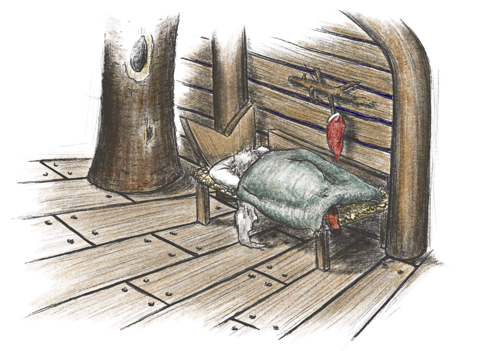
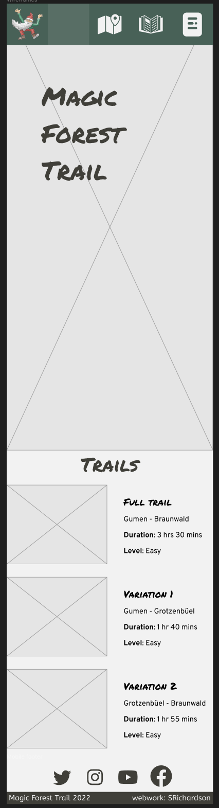
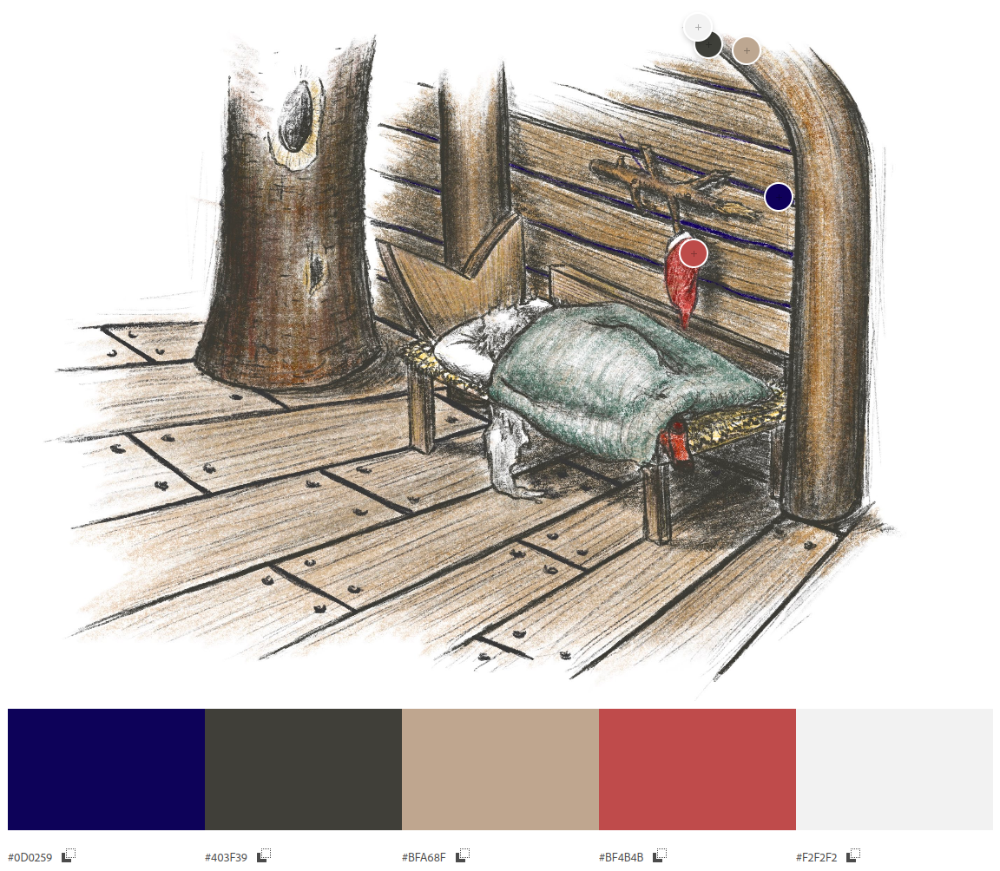
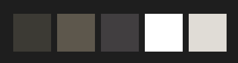
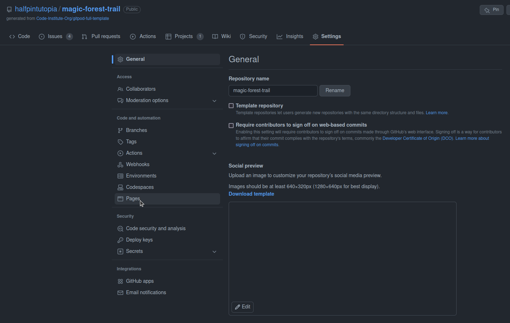
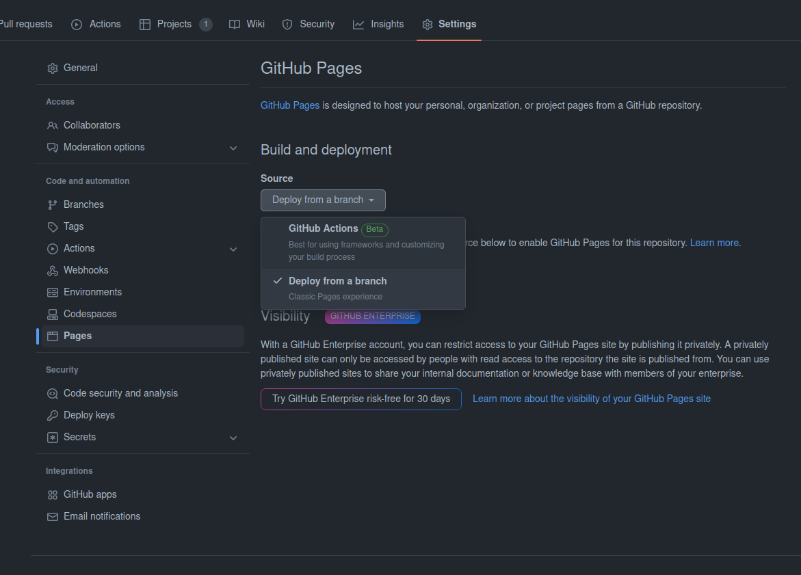
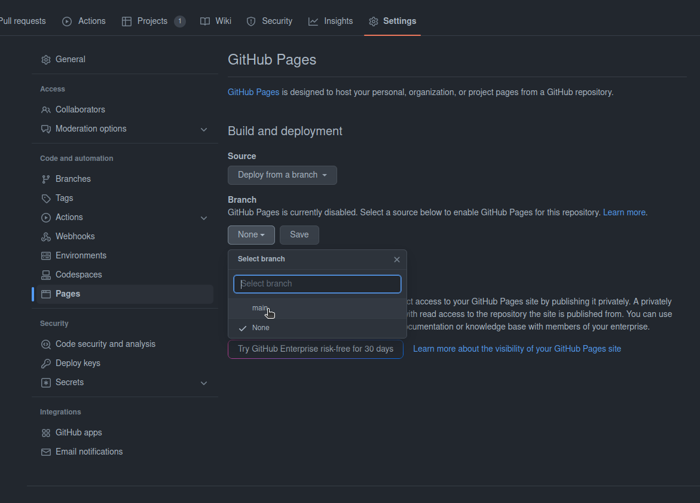

# Magic Forest Trail

[View the live project here.](https://halfpintutopia.github.io/magic-forest-trail/)

The website has been created solely for the course, but inpsired by an actual hiking trail based in Braunwald, Glarus-Süd in the North East of Switzerland. "Zwerg Bartli", a moutain dwelling drawf, is an affectionately well know character in this area. A fictitious character   made famous by a children's book.  The idea of the website came about, when a colleague, Hermina, enthused about the trail and taking her children to it. She is very motivated in breathing a new breath of life into this attraction and wanted and I thought it would be a win-win to provide a basic website to get her personal project started.



---

## Table of contents
* [User Experience (UX)](#user-experience-ux)
    * [Intended Audience](#intended-audience)
    * [User stories](#user-stories)
* [Design](#design)
* [Technologies Used](#technologies-used)
    * [Languages Used](#languages-used)
    * [Frameworks, Libraries and Programs Used](#frameworks-libraries-and-programs-used)
* [Credit](#credit)
    * [Code](#code)
    * [Content](#content)
    * [Media](#media)
        * [For leaf collage in the "Idea 2 - Landing page"](#for-leaf-collage-in-the-idea-2---landing-page)
    * [Acknowledgements](#acknowledgements)
    * [List of references](#list-of-references)
    * [References](#references)
* [Future ideas](#future-ideas)


---

# User Experience (UX)

## Intended Audience

* Parents with children
* Families
* Schools

---

* First Time Visitor Goals
    * Find information about the trails
    * Find the out how to get to the start of the trails
    * Find information about the distance of the trails
    * Find variations of the trial
    * Find the difficulty / suitability of the trails
    * Be able to contact Braunwaldbahn, the company that provides the cable car sevice
    * See images of the trail
    * Share their photos on social media
* Return Vistor Goals
    * Try alternative routes
    * Try other activities provided in the area
    * Stay overnight in the accommodation provided in the area 
    * Try other recommended activities in the local area
* Frequent Vistor Goals
    * Refer their friends, families and associates about the trail. 
    

* ## User stories
* Create content that is child appropriate
* Create content for adults or parents with children
* Provide easy access to routes
    * Show terrain (whether steep or steady climbs)
    * Show distances
    * Show approximate times to hike
    * Show difficulty level
* Provide details of how to get to Braunwald by car or train
* Provide a form
    * For people to book family passes in advance
    * To ask questions about the trail 
    * To ask about other activities in the area
* Provide a platform that boosts in tourism in the area


## Design
Wireframes were created for the site with [Figma](https://www.figma.com). 



*[Landing page - mobile view](https://color.adobe.com/create/image)*

--- 


*[Landing page - desktop view](https://color.adobe.com/create/image)*

To see the full wireframe, view it [here](https://www.figma.com/file/mY6L1TpxKS6PupGlHRLvVF/PP1-Wireframe?node-id=0%3A1&t=29queejCZUsKPnX9-1).

The wireframes are set for light mode but plan to implement dark mode.

Building from mobile first, I focused on swiping gestures. There are a couple prototype ideas I was playing with but the main idea was to create the landing page with horizontal scrolling. Taking into account new user experiences such as streaming channels like Netflix and phone apps like Tinder, swiping has become quite an expected experience for user.

> Gestures are the new clicks. ...gestures are very effective as they are very natural. With an increasing amount of content on the screens, it is really hard to balance what to have on the screen and what to hide. Using gestures, we can hide the buttons and elements and drive the user to focus more on the content.[[1]][How gestures are shaping the future of UX]

My prototype evolved further when Hermian agreed to provide some beautiful illustration. From the initial image I created the color scheme, the look and feel fo the site.

I initially created two differently stlyed landing pages. This was to try out styles but also to get a feeling about which would be more suitable. Tested the reaction on my partner, and I felt that it did not suit the user story brief. The idea was created as I wanted a synergy between the hand-drawn images, and the illustrated story boook and the content on the page. ["Idea 2 - Landing page"](https://www.figma.com/proto/6KQhxGl6q3N0ccFwV6UxXw/PP1?node-id=0%3A1&scaling=scale-down&starting-point-node-id=99%3A137&show-proto-sidebar=1).



*[Adobe Color](https://color.adobe.com/create/image)*

---
 

    ```
    --black-olive: hsla(45, 7%, 22%, 1);
    --davys-grey: hsla(39, 10%, 33%, 1);
    --jet: hsla(320, 2%, 25%, 1);
    --white: hsla(0, 0%, 100%, 1);
    --timberwolf: hsla(36, 14%, 86%, 1);
    ```
*Color Palette created from the Image Picker function on the [coolors.co](https://coolors.co/image-picker) website*

# Technologies Used

## Languages Used
* HTML5
* CSS3

## Frameworks, Libraries and Programs Used
* Google Fonts
    * Google fonts was used to import the font to the style.css which is used on all pages throughout the project.
* Font Awesome
    * Font Awesome was used on all necessary pages throughout the website to add icons for aesthetic and UX purposes.
* Git
    * Git was used for version control by utilising the Gitpod terminal to commit to git and push to GitHub.
* GitHub
    * Github was used to store the project's code after being pushed from Git.
* LeafletJS - [Use of GeoJSON with Leaflet](https://leafletjs.com/examples/geojson/) 
* Figma


# Credit

## Code


* 

## Content
* [Visit Glarnerland](https://glarnerland.ch/de/map/detail/zwerg-bartli-erlebnisweg-9ff632fe-5eaf-45d9-a6ea-4d743635148f.html) 
* Character based on Der Zwerg Bartli by Lorly Jenny


## Media
### Compression
*[Created webp images following guide on Digital Ocean](https://www.digitalocean.com/community/tutorials/how-to-create-and-serve-webp-images-to-speed-up-your-website)*
* [An image format for the Web](https://developers.google.com/speed/webp)

Wanted to use webp images due to the size which if too large would slow down the site. Also, added the ```lazy-loading``` attribute. 

Font sizes, margins and paddings were calculated using ```clamp()```, to make the site responsive without having to create media queries.[[2]][[[3]]]

* Images kindly provided by Hermina 
* Pawprints by <a href="https://pixabay.com/users/b0red-4473488/?utm_source=link-attribution&amp;utm_medium=referral&amp;utm_campaign=image&amp;utm_content=2165814">b0red</a> from <a href="https://pixabay.com//?utm_source=link-attribution&amp;utm_medium=referral&amp;utm_campaign=image&amp;utm_content=2165814">Pixabay</a>
* Footprint by <a href="https://pixabay.com/users/openclipart-vectors-30363/?utm_source=link-attribution&amp;utm_medium=referral&amp;utm_campaign=image&amp;utm_content=155457">OpenClipart-Vectors</a> from <a href="https://pixabay.com//?utm_source=link-attribution&amp;utm_medium=referral&amp;utm_campaign=image&amp;utm_content=155457">Pixabay</a>
* [Photo by Nouman Raees from Pexels](https://www.pexels.com/photo/green-trees-on-brown-soil-3670681/)
* [Photo by Josh Willink](https://www.pexels.com/photo/shallow-focus-on-blond-haired-woman-in-white-long-sleeve-shirt-carrying-a-baby-on-her-back-701016/)
* [Photo by Susanne Jutzeler, suju-foto](https://www.pexels.com/photo/two-girls-sitting-on-brown-bench-near-body-of-water-1292006/)
* [Photo by Allan Mas](https://www.pexels.com/photo/child-drawing-picture-on-concrete-block-in-grassy-yard-5623752/)
* [Pawprint animation](https://designmodo.com/demo/stepscss/pawprints.html)


* #### For leaf collage in the ["Idea 2 - Landing page"](https://www.figma.com/proto/6KQhxGl6q3N0ccFwV6UxXw/PP1?node-id=0%3A1&scaling=scale-down&starting-point-node-id=99%3A137&show-proto-sidebar=1)
    * [Photo by Michael Hauer](https://www.pexels.com/photo/photo-of-chestnuts-on-a-tree-during-autumn-11263797/) 
    * [Photo by Daria Andrievskaya](https://www.pexels.com/photo/yellow-tree-in-autumn-11066638/) 
    * [Photo by Min An](https://www.pexels.com/photo/photography-of-leaves-under-the-sky-1131458/) 

## Acknowledgements

## List of references
[How gestures are shaping the future of UX
](https://uxdesign.cc/how-gestures-are-shaping-the-future-of-ux-ce2c9e6d7a9f)

### References
[How gestures are shaping the future of UX
]: https://uxdesign.cc/how-gestures-are-shaping-the-future-of-ux-ce2c9e6d7a9f
[min(), max(), and clamp(): three logical CSS functions to use today]: (https://web.dev/min-max-clamp/)
[Modern Fluid Typography Using CSS Clamp]: (https://www.smashingmagazine.com/2022/01/modern-fluid-typography-css-clamp/)
[RFS]: (https://github.com/twbs/rfs#installation)

## Future ideas
* Add SwissMobility API to show the ascent and descent
* Connect Instagram feed

Photo by <a href="https://unsplash.com/@planetlb?utm_source=unsplash&utm_medium=referral&utm_content=creditCopyText">Juha Lakaniemi</a> on <a href="https://unsplash.com/s/photos/pine-tree-branch?utm_source=unsplash&utm_medium=referral&utm_content=creditCopyText">Unsplash</a>
  Photo by <a href="https://unsplash.com/@lapunin?utm_source=unsplash&utm_medium=referral&utm_content=creditCopyText">Sergey Lapunin</a> on <a href="https://unsplash.com/s/photos/pine-tree-branch?utm_source=unsplash&utm_medium=referral&utm_content=creditCopyText">Unsplash</a>
  Photo by <a href="https://unsplash.com/@sergidolcet?utm_source=unsplash&utm_medium=referral&utm_content=creditCopyText">Sergi Dolcet Escrig</a> on <a href="https://unsplash.com/s/photos/pine-tree-branch?utm_source=unsplash&utm_medium=referral&utm_content=creditCopyText">Unsplash</a>
  Photo by <a href="https://unsplash.com/@anniespratt?utm_source=unsplash&utm_medium=referral&utm_content=creditCopyText">Annie Spratt</a> on <a href="https://unsplash.com/s/photos/pine-tree-branch?utm_source=unsplash&utm_medium=referral&utm_content=creditCopyText">Unsplash</a>
  Photo by <a href="https://unsplash.com/@hans_isaacson?utm_source=unsplash&utm_medium=referral&utm_content=creditCopyText">Hans Isaacson</a> on <a href="https://unsplash.com/s/photos/pine-tree-branch?utm_source=unsplash&utm_medium=referral&utm_content=creditCopyText">Unsplash</a>
  Image by <a href="https://pixabay.com/users/janeb13-725943/?utm_source=link-attribution&amp;utm_medium=referral&amp;utm_campaign=image&amp;utm_content=1177545">Welcome to All ! ツ</a> from <a href="https://pixabay.com//?utm_source=link-attribution&amp;utm_medium=referral&amp;utm_campaign=image&amp;utm_content=1177545">Pixabay</a>
  Image by <a href="https://pixabay.com/users/clker-free-vector-images-3736/?utm_source=link-attribution&amp;utm_medium=referral&amp;utm_campaign=image&amp;utm_content=36730">Clker-Free-Vector-Images</a> from <a href="https://pixabay.com//?utm_source=link-attribution&amp;utm_medium=referral&amp;utm_campaign=image&amp;utm_content=36730">Pixabay</a>


  By choosing to use the top tabbed menus, it makes it easier to see everything available on the site at a glance. As there less then 5 nav items.
  As it is visible it should also stimulate the user to discover more.

[]()
*Quick link video for trails*


  ## Deployment
  

https://user-images.githubusercontent.com/30613818/205482822-4c33545b-8b52-4a2b-9212-0e119214ff22.mov


*Screencast of deployment*

1. Go to repository
2. Click Settings tab
3. Click on Pages in the left hand menu, under Code and automation 
*Screenshot of how to get the Pages section*

4. Under Build and deployment > Source ensure Deploy from a branch is selected 
*Screenshot of source option*

5. Under Build and deploment > Branch select main branch 
*Screenshot of branch option*

6. Click save
7. It may take more than a few minutes, but when the page has been created, you will see the following success message

[]()
*Screenshot of success message*

# Code
## Forking 


Hiking images
Photo by <a href="https://unsplash.com/@giger_00?utm_source=unsplash&utm_medium=referral&utm_content=creditCopyText">Curdin Giger</a> on <a href="https://unsplash.com/s/photos/hiking-switzerland?utm_source=unsplash&utm_medium=referral&utm_content=creditCopyText">Unsplash</a>
Photo by <a href="https://unsplash.com/@bladeoftree?utm_source=unsplash&utm_medium=referral&utm_content=creditCopyText">Marco Meyer</a> on <a href="https://unsplash.com/s/photos/hiking-switzerland?utm_source=unsplash&utm_medium=referral&utm_content=creditCopyText">Unsplash</a>
Photo by <a href="https://unsplash.com/@msafwat?utm_source=unsplash&utm_medium=referral&utm_content=creditCopyText">Mohammed Abdullatif</a> on <a href="https://unsplash.com/s/photos/hiking-switzerland?utm_source=unsplash&utm_medium=referral&utm_content=creditCopyText">Unsplash</a>
Photo by <a href="https://unsplash.com/@chris_regg?utm_source=unsplash&utm_medium=referral&utm_content=creditCopyText">Christian Regg</a> on <a href="https://unsplash.com/s/photos/hiking-switzerland?utm_source=unsplash&utm_medium=referral&utm_content=creditCopyText">Unsplash</a>
Photo by <a href="https://unsplash.com/@mamuej?utm_source=unsplash&utm_medium=referral&utm_content=creditCopyText">Marc</a> on <a href="https://unsplash.com/s/photos/hiking-switzerland?utm_source=unsplash&utm_medium=referral&utm_content=creditCopyText">Unsplash</a>
Photo by <a href="https://unsplash.com/@allphotobangkok?utm_source=unsplash&utm_medium=referral&utm_content=creditCopyText">Paul Szewczyk</a> on <a href="https://unsplash.com/s/photos/hiking-switzerland?utm_source=unsplash&utm_medium=referral&utm_content=creditCopyText">Unsplash</a>
  

Testing
Font sizing was not being responsive, used clamp()
Color scheme fitting the 70/20/10 ratio, there were too much 
Slow loading images use loading lazy and https://www.freecodecamp.org/news/a-guide-to-responsive-images-with-ready-to-use-templates-c400bd65c433/

https://matthewjamestaylor.com/responsive-font-size
https://css-tricks.com/snippets/css/a-guide-to-flexbox/
https://www.cssmatic.com/box-shadow
https://css-tricks.com/a-guide-to-the-responsive-images-syntax-in-html/#using-picture
https://web.dev/browser-level-image-lazy-loading/
https://www.editorx.com/shaping-design/article/font-size
https://utopia.fyi
https://css-tricks.com/early-days-of-container-style-queries/
https://www.freecodecamp.org/news/a-guide-to-responsive-images-with-ready-to-use-templates-c400bd65c433/
https://www.freecodecamp.org/news/the-100-correct-way-to-do-css-breakpoints-88d6a5ba1862
https://zoomadmin.com/HowToInstall/UbuntuPackage/graphicsmagick
https://developer.chrome.com/en/docs/lighthouse/performance/uses-long-cache-ttl/
https://inkscape.org/
https://www.gimp.org/
https://fontawesome.com
https://app.svgator.com