# Magic Forest Trail


[View the live project here.](https://halfpintutopia.github.io/magic-forest-trail/){target="_blank"}

The website is a fan website and has been created solely for the course, but inpsired by an actual hiking trail based in Braunwald, Glarus-Süd in the North East of Switzerland. "Zwerg Bartli", a moutain dwelling drawf, is an affectionately well know character in this area. A fictitious character made famous by a children's book. 


---

## Table of contents
* [User Experience](#user-experience-ux)
  * [Intended Audience](#intended-audience)
  * [User Stories](#user-stories)

* [Design](#design)
  * [Wireframes](#wireframes)
  * [Colour Scheme](#colour-scheme)
  * [Typography](#typography)
  * [Imagery](#imagery)

* [Features](#features)
  * [General Features on Each Page](#general-features-on-each-page)
  * [Future Implementations](#future-implementations)
  * [Accessibility](#accessibility)

* [Technologies Used](#technologies-used)
  * [Languages Used](#languages-used)
  * [Frameworks, Libraries & Programs Used](#frameworks-libraries-and-programs-used)

* [Remote & Local Development](#remote-and-local-deployment)
  * [Remote Deployment](#remote-deployment)
  * [Local Development](#local-development)
    * [How to Fork](#how-to-fork)
    * [How to Clone](#how-to-clone)

* [Testing](#testing)

* [Credits](#credits)
  * [Code Used](#code-used)
  * [Content](#content)
  * [Media](#media)
  * [Acknowledgments](#acknowledgments)

---

# User Experience (UX)

Designed and developed mobile first. 

The idea of the website was inspired by a friend, Hermina Oláh Vass,Her family are very enthusiastic about the trail. She is very motivated in breathing a new breath of life into this attraction and wanted and I thought it would be a win-win to provide a basic website to get her personal project started.

## Intended Audience

* Parents with children
* Families
* Schools


* ## User stories

* Client Goals
    * Provide content that is child appropriate
    * Provide content for adults or parents with children
    * Provide easy access to routes
        * Show trail distances
        * Show approximate times to hike
        * Show difficulty level
    * Provide a booking form
        * For people to book family passes in advance
        * To also ask questions about the trail
* First Time Visitor Goals
    * Find information about the trails
    * Find the out how to get to the start of the trails
    * Find information about the distance of the trails
    * Find variations of the trial
    * Find the difficulty / suitability of the trails
    * See images of various trails
* Return Vistor Goals
    * Try alternative routes
* Frequent Vistor Goals
    * Refer their friends, families and associates about the trail.


# Design

## Wireframes
Wireframes were created for the site with [Figma](https://www.figma.com).


*Wireframe for mobile and desktop*

<details>
<summary>Home page for mobile and desktop</summary>
<br>


*Landing page - mobile and desktop*
</details>
<br>

<details>
<summary>Trail list for mobile and desktop</summary>
<br>


*Trail list section - mobile and desktop*
</details>
<br>

<details>
<summary>Trail page for mobile and desktop</summary>
<br>


*Trail page - mobile and desktop*
</details>
<br>

<details>
<summary>Form view for mobile and desktop</summary>
<br>


*Form - mobile and desktop*
</details>
<br>

<details>
<summary>Form success page for mobile and desktop</summary>
<br>


*Form success page - mobile and desktop*
</details>
<br>

<details>
<summary>Header navigation and footer for mobile and desktop</summary>
<br>


*Header navigation and footer - mobile and desktop*
</details>
<br>

<details>
<summary>Page not found page for mobile and desktop</summary>
<br>


*Page not found page - mobile and desktop*
</details>

To see the full wireframe, view it [here](https://www.figma.com/file/mY6L1TpxKS6PupGlHRLvVF/PP1-Wireframe?node-id=0%3A1&t=29queejCZUsKPnX9-1).

---

The website consists of:

* Home page
* Storybook page
* Form page with a a success page
* Trail page
    * Additional pages for each trail shown on the trail cards displayed on the home page
* A 404 page

## Colour Scheme

The colour palette should complement greens, to represent nature and the forest. The red was to represent Bartli's hat. 

Created colour palette using:
* [Adobe Color](https://color.adobe.com/create/image) 
* [coolors.co](https://coolors.co/image-picker).


Due to assessibility, and feedback from a Lighthouse test, the red color was changed. 

## Typography

Permanent Marker and Overpass Fonts chosen from [Google Fonts](https://fonts.google.com). Fonts were chosen to represent fun and playful as well as being clear easy to read.


<br>

### References for typography:

When thinking about typography, the type had to suit responsively as well. The fonts had to be also readable on mobile view.

Using Utopia, clamp for fonts and spaces were created. This minimised errors where fonts would be oversized or too small on desktop or mobile devices. 

* [min(), max(), and clamp(): three logical CSS functions to use today](https://web.dev/min-max-clamp/)
* [Modern Fluid Typography Using CSS Clamp](https://www.smashingmagazine.com/2022/01/modern-fluid-typography-css-clamp/)
* [RFS](https://github.com/twbs/rfs#installation)
* [Utopia - Responsive font and space sizing](https://utopia.fyi)

## Imagery

Images are located on all pages. The top of the page under the navigation is the header image. All pages have the same thematic layout, the layout should be consistent on all pages except on the home page. 

Hiking photos have been used from:

* [Pexels](https://www.pexels.com/)
* [Unsplash](https://unsplash.com/)


Illustrated images, icons and favicon were generously provided by:

* Hermina Oláh Vass


All images should match the theme of the site, families with children on hiking activites. The hand-drawn illustrations were to support the theme of the trail being inspired from a illustrated storybook. 

All images were compressed. To increase the speed of the website. Also, added the ```lazy-loading``` attribute to images showing below the fold.

### References for images

* [An image format for the Web](https://developers.google.com/speed/webp)
* [A Guide to Responsive Images with Ready-to-Use Templates](https://medium.com/free-code-camp/a-guide-to-responsive-images-with-ready-to-use-templates-c400bd65c433)

<br>

Icons were used for social links and buttons. The icons used on the site were taken from:

* [Font Awesome](https://fontawesome.com/)

<br>

The footprints svg was created using the svg from:

* [Pixabay](https://pixabay.com)

* [Footprint](https://pixabay.com/vectors/shoe-print-boot-mark-traces-36730/) by <a href="https://pixabay.com/users/openclipart-vectors-30363/?utm_source=link-attribution&amp;utm_medium=referral&amp;utm_campaign=image&amp;utm_content=155457">OpenClipart-Vectors</a> from <a href="https://pixabay.com//?utm_source=link-attribution&amp;utm_medium=referral&amp;utm_campaign=image&amp;utm_content=155457">Pixabay</a>

The footprints were created from using GIMP to manipulate the image, and then the SVG was created with Inkscape. 

# Features

Details of each feature are listed under [General Features on Each Page](#general-features-on-each-page).

The website consists of the following pages:
* Home page
* Storybook page
* Individual trail pages
    * Full trail
    * Option 1
    * Option 2
    * Option 3
    * Option 4
    * Option 5
* Form page
    * with a success page
* 404 page 

---

[Home](https://halfpintutopia.github.io/magic-forest-trail/index.html){target="_blank"}

The home page consists of 5 sections. 
* Full height and width image with:
    * text overlay
    * button to scroll down to trail cards
* Image, title and text
* Trail cards
* Image, title and text (reversed order)
* Gallery
* Floating booking button

--- 

[Storybook](https://halfpintutopia.github.io/magic-forest-trail//storybook.html){target="_blank"}

The storybook page consists of:
* Image banner at the top of the page
* Multiple image, title and text, alternatively reversing the order

---

[Individual trail page](https://halfpintutopia.github.io/magic-forest-trail/trails/full-trail.html){target="_blank"}

Individual trail pages are accessed via the home page. A link around each card, directs visitors to the see more about the trail.

The trail page consists of:
* Image banner at the top of the page
* Statistics divided into 3 "boxes"
* A back to trail list link, which redirects visitors back to the home page to the Trail Cards
* A table of the stages, trails are divided into easy to walk stages
* A map with markers of the locations indicated in the stages

---

[Form](https://halfpintutopia.github.io/magic-forest-trail/contact-us.html){target="_blank"}

The form page consists of:
* A table to clear present the tickets and prices
* Form to add first name, last name, email address, number of adults and children and additional comments.
* A map with the location of the main station

---

Every page except the 404, success and form page have a CTA Button, which a button to take visitors to the booking form.

## General Features on Each Page 

### Specific features

#### Trail List


*Screenshot of the trail (lists) feature for mobile*

<br>


*Screenshot of the trail (lists) feature for desktop*

<br>

The trail list are displayed as cards. The text description length of each card depends on the size of the device. A class was added to to shorten the text, so that the card heights were not too tall on mobile devices. 

#### Gallery


*Screenshot of the gallery feature for mobile*

<br>


*Screenshot of the gallery feature for desktop*

<br>

The gallery is in a grid layout masonry style. The gallery was to suit and demonstrate images that are meant to be viewed in potrait or landscape.

### Buttons

#### Call to action


*Screenshot of the cta feature for mobile*

<br>


*Screenshot of the cta feature for desktop*

<br>

The button link for the contact form is a floating element on the page. This was changed from the original wireframe, as wanted the CTA button to be visible whereever the user was on the page. Floating it made it visible and accessible for visitors to easily click. 


#### Back to trails button

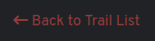

*Screenshot of the back button feature for mobile*

<br>

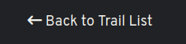

*Screenshot of the back button feature for desktop*

<br>

The back button is to enable visitors to go back to the trail list easily after viewing the trail page. On mobile the back link is always coloured red, but on the desktop there is a hover effect from white to red. 


#### Explore button

https://user-images.githubusercontent.com/30613818/208512665-33657fd0-3047-4207-b8a4-384b875249ab.mov

The explore button is located on landing page. The button takes visitors directly to the trail cards, so that they can explore the different trail. 

### Header image

### With stats and back button

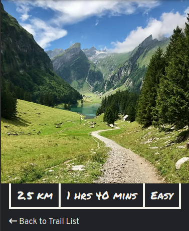

*Screenshot of the header image for trail page with statistics and back button feature for mobile*

<br>

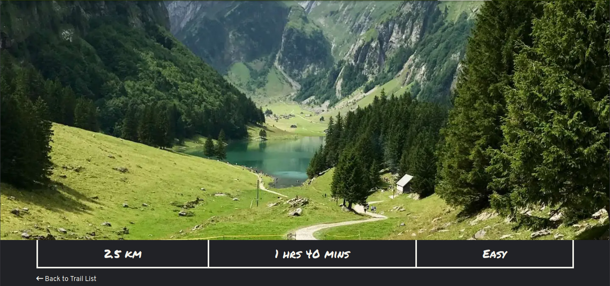

*Screenshot of the header image for trail page with statistics and back button feature for desktop*

<br>

The header image, should be the first view of the landscape and also quick information about the trail. Showing the distance, approximate time to hike and the level of ease.  

### Trail map

#### Map using leaflet.js

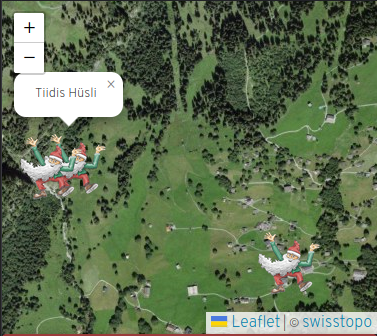

*Screenshot of the trail map on trail page feature for mobile*

<br>

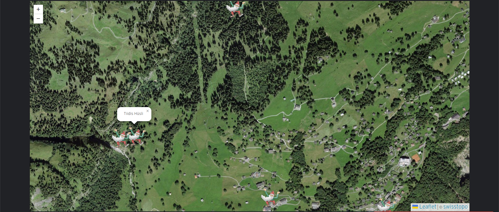

*Screenshot of the trail map on trail page feature for desktop*

<br>

The trail map should show all the locations the trail encounters. The trail map markers are custom markers of Bartli.


### Text and image

#### Text Image Sections (with & without quicklinks)

Version 1:


*Screenshot of the text image feature for mobile*

<br>


*Screenshot of the text image feature for desktop*

<br>

Version 2:


*Screenshot of the text image with quicklinks feature for mobile*

<br>


*Screenshot of the text image with quicklinks feature for desktop*

<br>

There are two version of the text-image feature. 

The first one can be found on the home page. This is simple layout of image and text. When multiple image text sections are on the same page, they are set to be alternative sides. The text remains in a container and the image stretches to either the left or right side, dependendant on which side of the text it is positioned. This effect was to fill empty space on wider devices.

The second version is seen on the storybook page. The layout is exactly the same. The content is slightly different, as under each text, there is a link which enables the visitor to quickly go the trail page if they are interested to visit the place mentioned in the story. 

## Future Implementations

1. Add SwissMobility API to show:
    * Show actual height
    * Show real distances
    * Show declines and inclines
    *  the ascent and descent
2. Connect Instagram API to enable hikers to share images
    * Share their photos on social media
    * Try other activities provided in the area
3. Connect to other local companies
    * Be able to contact Braunwaldbahn, the company that provides the cable car sevice
    * Stay overnight in the accommodation provided in the area
    * Try other recommended activities in the local area
4. Provide a platform that boosts in tourism in the area

## Assessiblity

* Use of semantic HTML
* Use of ARIA
* Use of alt attributes
* Provide an invisible "Skip to content" button for screen reader. Enabling visitors to skip navigation menu
* Use Adobe Color to check color contrast
* Fixed header, providing visitors with easy access to other pages
* Floating button element, providing visitors to easily reach the contact form

# Technologies Used

## Languages Used

* HTML5
* CSS3
* JavaScript

## Frameworks, Libraries and Programs Used

* [Google Fonts](https://fonts.google.com){target="_blank"}
    * Google fonts was used to import the font to the style.css which is used on all pages throughout the project.
* [Font Awesome](https://fontawesome.com/){target="_blank"}
    * Font Awesome was used on all necessary pages throughout the website to add icons for aesthetic and UX purposes.
* [Git](https://git-scm.com/){target="_blank"}
    * Git was used for version control by utilising the Gitpod terminal to commit to git and push to GitHub.
* [GitHub](https://github.com/){target="_blank"}
    * Github was used to store the project's code after being pushed from Git.
* [Gitpod](https://www.gitpod.io/){target="_blank"}
* [Coolors](https://coolors.co/){target="_blank"}
* [Adobe Color](https://color.adobe.com/create/color-wheel){target="_blank"}
* [Pexels](https://www.pexels.com/){target="_blank"}
* [Unsplash](https://unsplash.com/){target="_blank"}
* Devtool
    * [Firefox](https://firefox-source-docs.mozilla.org/devtools-user/){target="_blank"}
    * [Chrome](https://developer.chrome.com/docs/devtools/){target="_blank"}
* [Browserstack](https://www.browserstack.com){target="_blank"}
* [LeafletJS](https://leafletjs.com/){target="_blank"} - [Use of GeoJSON with Leaflet](https://leafletjs.com/examples/geojson/){target="_blank"}
* [Figma](https://www.figma.com/){target="_blank"}
* [Inkscape](https://inkscape.org/){target="_blank"}
* [GIMP](https://www.gimp.org/){target="_blank"}
* [SVGator](https://app.svgator.com){target="_blank"}

# Remote and Local Deployment

Git was used for version control. Version control was done locally and remotely. For remote version control, GitHub was used. Regular commits were made after each file change.

## Remote deployment
Github Pages was used to deploy the site remotely. 

https://user-images.githubusercontent.com/30613818/205482822-4c33545b-8b52-4a2b-9212-0e119214ff22.mov

*Screencast of deployment*

<br>

1. Go to repository
2. Click Settings tab
3. Click on Pages in the left hand menu, under Code and automation 
   *Screenshot of how to get the Pages section*

4. Under Build and deployment > Source ensure Deploy from a branch is selected 
   *Screenshot of source option*

5. Under Build and deploment > Branch select main branch 
   *Screenshot of branch option*

6. Click save
7. It may take more than a few minutes, but when the page has been created, you will see the following success message 
   *Screenshot of success message*


## Local Deployment

To contribute or check the code yourself, you can:
* fork the repository
* clone the repository

### How to Fork

1. To fork go the repository
2. Click on the Fork button in the top left corner of the page. 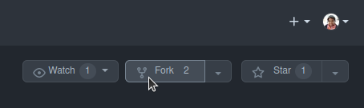
3. Fill in the form with either keep the name or create a new name for the repository 

### How to Clone

1. To clone on the repository 
2. Click on the Code button above the repository files. 
3. A drop down will appear and choose either 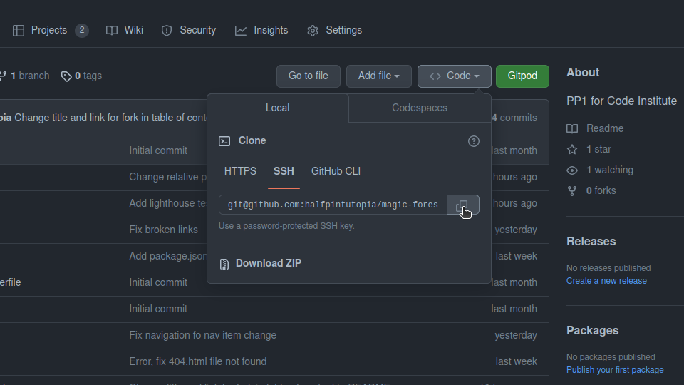: 
    * HTTPS
    * SSH
    * GitHub CLI 
4. Go to your terminal and decide where you want to clone the files.
5. Use the copy / paste button and copy into your terminal
6. You also have the option to download a ZIP file of the code

# Testing

Browserstack was used for testing. Devices selected were:
* Windows
    * Firefox 108 on Windows 11
    * Chrome 108 on Windows 11
* Apple
    * Ventura Safari 16
* Android
    * Chrome Galaxy S22
    * Xiaomi Redmi Note 11 Chrome
* Apple iOS
    * Safari iPhone SE 2022

## User experience

Testing implemented from [User stories](#user-stories)

### Client Goals Testing

| Client goal | Implementation | Tested | Successful |
| ------------- |:-------------:|:-----:|:-----:|
| Provide content that is child appropriate | The content was child-friendly | Yes | Yes |
| Provide content for adults or parents with children | The content is descriptive yet simple  | Yes | Yes |
| Provide easy access to routes |  Trail list navigated to via the nav bar. Quick links added to the Storybook page | Yes | Yes |
| Inform visitors of trail distances | Trail details, distances easily seen on the top of the page  | Yes | Yes |
| Inform visitors of approximate times to hike trail | Trail details, approximate times easily seen on the top of the page  | Yes | Yes |
| Inform visitors of difficulty levels | Trail details, difficulty levels easily seen on the top of the page  | Yes | Yes |
| Provide a booking form | Accessible via the CTA button show on all pages  | Yes | Yes |
| Provide a form which allows users to book family passes in advance | Form has inputs for booking number of adults and children for family pass | Yes | Yes |
| Provide a form for visitors to ask question about the trail | Textarea input added for users to ask comments or ask questions | Yes | Yes |

### First Time Visitor Goals

| First Time Visitor Goals | Implementation | Tested | Successful |
| ------------- |:-------------:|:-----:|:-----:|
| Find information about the trails | Trail list shows available trails. The link from home page takes visitors to individual trail pages  | Yes | Yes |
| Find information about the distance of the trails | Information about the distance is above the fold on individual trail pages | Yes | Yes |
| Find variations of the trial | List of trail variations are on the home page  | Yes | Yes |
| Find the difficulty of the trails | Information about the level is above the fold on individual trail pages  | Yes | Yes |
| See images of various trails | Images of trail in the gallery on the home page. Main image in header is of the trail | Yes | Yes |

### Return Visitor Goals

| Return Vistor Goals | Implementation | Tested | Successful |
| ------------- |:-------------:|:-----:|:-----:|
| Try alternative routes | List of trails on home page. Visitors can check other routes | Yes | Yes |


### Frequent Visitor Goals

| Frequent Vistor Goals | Implementation | Tested | Successful |
| ------------- |:-------------:|:-----:|:-----:|
| Refer their friends, families and associates about the trail | Visitors can share the [trail list](https://halfpintutopia.github.io/magic-forest-trail/index.html#trails) and each of the individual trail pages | Yes | Yes |

### Bugs and fixes

|Bug / Errors | Where / Location site | Browser | Device | Remarks | Mode (light / dark) | Fixed | Solution |
|-------------|-----------------------|---------|--------|---------|:-------------------:|:-----:|----------|
| Fields in form not visible | contact form | Chrome, Firefox | Apple Laptop| | dark | Yes | Change line colors for field. Applied color for dark and light mode |
| Only adults and kids visible (missing: first name, last name, email, telephone)| contact form | Chrome | Apple Laptop | | dark | Yes | Change font color to suit dark and light mode |
| Arrows to add / sub adults / kids only visible on mouse over | contact form | Chrome | Apple Laptop | | dark | | No | Arrow color are determined by the browser |
| Reference * not visible (bottom of the page) | contact form | Chrome | Apple Laptop | actually there are * but they are at form fields marking mandatory entries, slightly confusing | dark | | Yes | Removed the reference as it was not relevant to the content |
| Social media icons go white (on white) therefore not visible on mouse over everywhere / every page | Chrome, Firefox | Apple Laptop| | | dark | Yes | Changed the icon colors in the footer |
| Twitter link typo - redirects to "twiiter" instead of "twitter" | everywhere / every page | Chrome, Firefox | Apple Laptop | | dark | Yes | Corrected typos |
| Text box / frame of text box not visible | contact form | Chrome, Firefox | Apple Laptop| | dark | Yes | Added border to textarea field. Applied color for both dark and light mode |
| Image not loading | full trail | Chrome, Firefox | Apple Laptop| | dark | Yes | Fixed the broken link by correcting the relative path |
| Zoom / pan on map does not include all dwarfs only top half | every trail page | Chrome | Apple Laptop | | dark | Yes | Added bounds to the leaflet map, to center the map according to all markers |
| Shorten text on first story (size is off in comparison to the next story bits) not a bug, just looking off | storybook | Chrome, Firefox | Apple Laptop| | dark | Yes | The text remains the same, but changed spacing on the text image grid areas |
| Links either labelled wrong or wrong links set (Trail option 3 leads to variation 1 etc.) | storybook | Chrome, Firefox | Apple Laptop | | dark | Yes | Fixed links to suit the actual href |
| Image not loading | full trail | Chrome | Android mobile | | dark | Yes | Fixed the broken link by correcting the relative path |
| Little arrow to expand / collapse above adults doesn't do anything | contact form | Chrome, Firefox | Apple Laptop | | light / dark | Yes | Form made visible from changing colors for dark and light mode |
| Neither the labels nor the placeholder texts are visible at the first name, last name, email and phone number inputs | contact form |  |  |  | dark | Yes | Make placeholders visible by changing the default opacity to 1 for input placeholders. Also had to fix specificity as initially assumed the issue had occurred due to the wrong pseudo element being selected. After trial and error, found that the problem occurred due to specificity, as form input was not specific enough. |
| Zoom out of your maps more than the max size of the maps are | All trail pages |  |  |  |  | Yes | Set a min and max zoom on the leaflet map |
| Error form display in Chrome does not always notify about wrong inputs. Firefox tells you correctly which input is wrong | contact form | Chrome | Apple Laptop | | dark | Not a fix | Chrome moves the page to the area of the error, the red border line highlights the missing information |
| When going back from trail page to storybook, last chosen trail option is marked in green instead of red. nice but not sure if intentional. does not happen in Chrome only ff | storybook | Firefox | Apple Laptop | | dark | Yes | Change the look of the button, ensure :visited psueudo is not used |

#### Not solved

The following bug was found, but it was hard to determine the reason for the jumping of the sticky button. It only occurred on mobie devices. The issue has not been resolved and added as an issue to GitHub

|Bug / Errors | Where / Location site | Browser | Device | Remarks | Mode (light / dark) |
|-------------|-----------------------|---------|--------|---------|:-------------------:|
| Book your family pass blocks scroll down text and animation; Book your family pass goes into hiding when scrolled to position of any header; Book your family pass seemingly jumps around randomly when scrolling; Book your family pass snaps back down after scrolling up from the bottom of the page | Home / Storybook | Chrome | Android mobile | | dark |


Additional images / videos re: not solved bug:

https://user-images.githubusercontent.com/30613818/208293996-427c7401-a60a-47dc-bd0f-677ca0110535.mp4


### Lighthouse

<details>
<summary>Home page</summary>

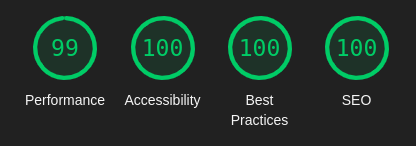

*Home page in light mode*

<br>

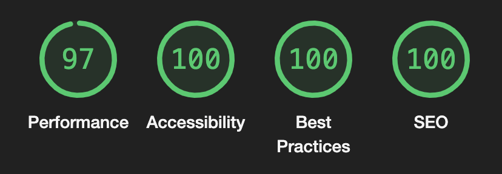

*Home page in dark mode*

</details>

<details>
<summary>Storybook page</summary>

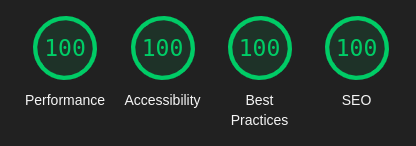

*Storybook page in light mode*

<br>


*Storybook page in dark mode*

</details>

<details>
<summary>Full trail page</summary>


*Full trail page in light mode*

<br>


*Full trail page in dark mode*

</details>

<details>
<summary>Option 1 trail page</summary>


*Option trail page in light mode*

<br>

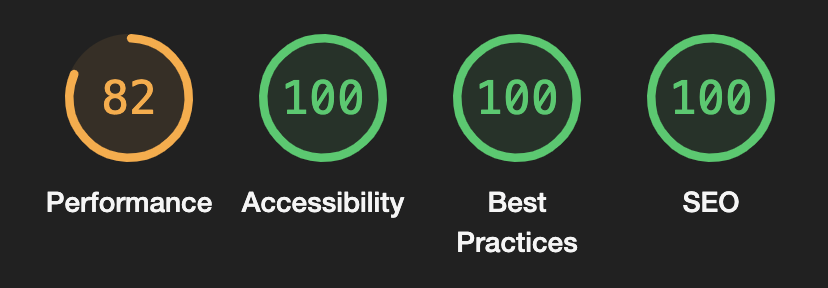

*Option trail page in dark mode*

</details>

<details>
<summary>Option 2 trail page</summary>


*Option 2 trail page in light mode*

<br>

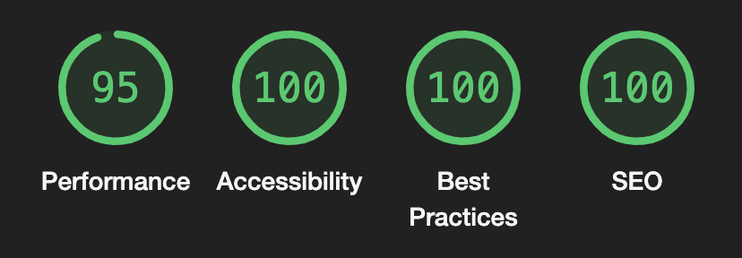

*Option 2 trail page in dark mode*

</details>

<details>
<summary>Option 3 trail page</summary>


*Option 3 trail page in light mode*

<br>


*Option 3 trail page in dark mode*

</details>

<details>
<summary>Option 4 trail page</summary>

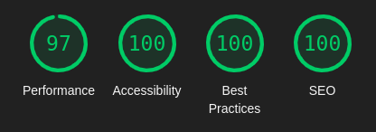

*Option 4 trail page in light mode*

<br>

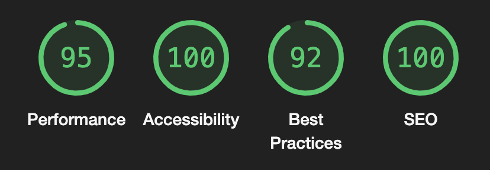

*Option 4 trail page in dark mode*

#### Error in Lighthouse testing

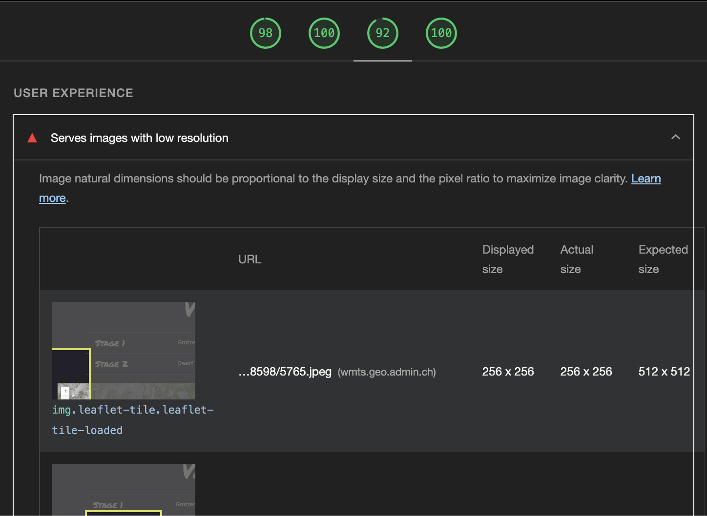

*Best practice error in dark mode*

<br>

The error states: 

"Image natural dimensions hsould be proportional to the display size and the pixel ratio to maximise image clarity."

This error looks to be from the map tile, as all the screenhots refer to the image added by the tile, linked by [vmts.geo.admin.ch](vmts.geo.admin.ch).

</details>

<details>
<summary>Option 5 trail page</summary>


*Option 5 trail page in light mode*

<br>


*Option 5 trail page in dark mode*

</details>

<details>
<summary>Contact us form page</summary>


*Contact us form page in light mode*

<br>


*Contact us form page in dark mode*

</details>

<details>
<summary>Success form page</summary>

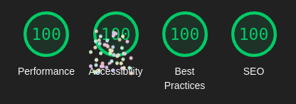

*Success form page in light mode*

<br>


*Success form page in dark mode*

</details>

<details>
<summary>404 page</summary>


*404 page in light mode*

<br>


*404 page in dark mode*

</details>

### Validator Testing

* Use [W3C Markup Validation Service](https://validator.w3.org) to validate all HTML pages
* Use [W3C CSS Validation Service](https://jigsaw.w3.org/css-validator/) to validate all stylesheets
    * Error (```width: min(100% - var(--container-padding), var(--container-max-width));```) caused from related to the following issue:
        * [Please add support for CSS variables ("custom properties"), a widely supported and crucial feature](https://github.com/w3c/css-validator/issues/111)

# Credits

## Code Used
All code is also reference as a comment in stylesheets.

* [Fix hover effect](https://css-tricks.com/cool-hover-effects-using-background-properties)
* [Fix error with scroll to content](https://www.youtube.com/watch?v=iGUSTyG-CYw)
* [Screen Reader only - hidden elements](https://github.com/h5bp/html5-boilerplate/blob/master/dist/css/style.css#L112)
* [Custom Checkbox](https://moderncss.dev/pure-css-custom-checkbox-style/)
* [Gallery layout](https://www.youtube.com/watch?v=rg7Fvvl3taU&t=1306s)
* [Containers](https://www.youtube.com/watch?v=VsNAuGkCpQU&t=366s)
* [Image with text overlay](https://www.youtube.com/shorts/oy2iUDT0mf8)
* [Assessibility - Kevin Powell - Most sites have a "hidden" link, and yours should too!](https://www.youtube.com/watch?v=jDDaOFr9nqQ)


### References & Resources
A list of references used for the site:

* [Kevin Powell](https://www.youtube.com/@KevinPowell)
* [Box shadows](https://www.cssmatic.com/box-shadow)
* [CSS Tricks - HTML Picture](https://css-tricks.com/a-guide-to-the-responsive-images-syntax-in-html/#using-picture)
* [Web Dev - Browser level image lazy loading](https://web.dev/browser-level-image-lazy-loading/)
* [Editorx - Font size](https://www.editorx.com/shaping-design/article/font-size)
* [The 100% correct way to do CSS breakpoints](https://www.freecodecamp.org/news/the-100-correct-way-to-do-css-breakpoints-88d6a5ba1862)
* [Containers - width for different devices](https://getbootstrap.com/docs/5.2/layout/containers)
* [Jonas Schmedtmann](https://www.udemy.com/user/jonasschmedtmann/)
* [Flexbox](https://css-tricks.com/snippets/css/a-guide-to-flexbox/)
    
## Content

The content created for this website were created by my partner, Stefan Tschudi, a colleague, Hermina Oláh Vass and myself. The story was loosely based from a rough translation of the character based on "Der Zwerg Bartli" by Lorly Jenny. 

All maps were created from actual locations found in [Zwerg-Bartli-Erlebnisweg](https://braunwald.ch/de/map/detail/zwerg-bartli-erlebnisweg-9ff632fe-5eaf-45d9-a6ea-4d743635148f.html). 

The address, email and telephone number on the contact page were made up and are not associated with Braunwald nor the story.

The trail is an actual locally well known tourist attaction. The trail locations were based on the actual trail in Braunwald, Glarus-Süd in Switzerland.

## Media

<details>
<summary>Homepage</summary>

* [Green Trees on Brown Soil](https://www.pexels.com/photo/green-trees-on-brown-soil-3670681/)
* [Footprint](https://pixabay.com/vectors/shoe-print-boot-mark-traces-36730/) by <a href="https://pixabay.com/users/openclipart-vectors-30363/?utm_source=link-attribution&amp;utm_medium=referral&amp;utm_campaign=image&amp;utm_content=155457">OpenClipart-Vectors</a> from <a href="https://pixabay.com//?utm_source=link-attribution&amp;utm_medium=referral&amp;utm_campaign=image&amp;utm_content=155457">Pixabay</a>

The footprints were created from using GIMP to manipulate the image, and then the SVG was created with Inkscape. 

* [Two Girls Sitting on Brown Bench Near Body of Water photo by Susanne Jutzeler, suju-foto](https://www.pexels.com/photo/two-girls-sitting-on-brown-bench-near-body-of-water-1292006/)

</details>

<details>
<summary>Gallery</summary>
<br>

* [Two boys hiking through tall trees in forest](https://unsplash.com/photos/e3PQpLM_SGo) by <a href="https://unsplash.com/@greg_rosenke?utm_source=unsplash&utm_medium=referral&utm_content=creditCopyText">Greg Rosenke</a> on <a href="https://unsplash.com/s/photos/kids-hiking-adventure?utm_source=unsplash&utm_medium=referral&utm_content=creditCopyText">Unsplash</a>
* [Man carrying child](https://unsplash.com/photos/nzUHrjz4wu4) by <a href="https://unsplash.com/@katiemoum?utm_source=unsplash&utm_medium=referral&utm_content=creditCopyText">Katie Moum</a> on <a href="https://unsplash.com/s/photos/kids-hiking-adventure?utm_source=unsplash&utm_medium=referral&utm_content=creditCopyText">Unsplash</a>

</details>


<details>
<summary>Trail list and Trail Pages</0summary>
<br>

* [White-Red-White Hiking flag painted on rock](https://unsplash.com/photos/ZIFccT5-36Y) by <a href="https://unsplash.com/@giger_00?utm_source=unsplash&utm_medium=referral&utm_content=creditCopyText">Curdin Giger</a> on <a href="https://unsplash.com/s/photos/hiking-switzerland?utm_source=unsplash&utm_medium=referral&utm_content=creditCopyText">Unsplash</a>
* [View of the view with the mountain as the backdrop](https://unsplash.com/photos/FNaFLvbLFuk) by <a href="https://unsplash.com/@chris_regg?utm_source=unsplash&utm_medium=referral&utm_content=creditCopyText">Christian Regg</a> on <a href="https://unsplash.com/s/photos/hiking-switzerland?utm_source=unsplash&utm_medium=referral&utm_content=creditCopyText">Unsplash</a>
* [View from the path that leads to the lake](https://unsplash.com/photos/guc520jc0lk) by <a href="https://unsplash.com/@mamuej?utm_source=unsplash&utm_medium=referral&utm_content=creditCopyText">Marc</a> on <a href="https://unsplash.com/s/photos/hiking-switzerland?utm_source=unsplash&utm_medium=referral&utm_content=creditCopyText">Unsplash</a>
* [View of mountain and valley below](https://unsplash.com/photos/NaEIPJ51EHE) by <a href="https://unsplash.com/@bladeoftree?utm_source=unsplash&utm_medium=referral&utm_content=creditCopyText">Marco Meyer</a> on <a href="https://unsplash.com/s/photos/hiking-switzerland?utm_source=unsplash&utm_medium=referral&utm_content=creditCopyText">Unsplash</a>
* [View from the top of the mountain](https://unsplash.com/photos/NaEIPJ51EHE) by <a href="https://unsplash.com/@msafwat?utm_source=unsplash&utm_medium=referral&utm_content=creditCopyText">Mohammed Abdullatif</a> on <a href="https://unsplash.com/s/photos/hiking-switzerland?utm_source=unsplash&utm_medium=referral&utm_content=creditCopyText">Unsplash</a>
* [Swiss Alps in the middle of summer on a sunny day](https://unsplash.com/photos/fZsIcej_bQA) by <a href="https://unsplash.com/@allphotobangkok?utm_source=unsplash&utm_medium=referral&utm_content=creditCopyText">Paul Szewczyk</a> on <a href="https://unsplash.com/s/photos/hiking-switzerland?utm_source=unsplash&utm_medium=referral&utm_content=creditCopyText">Unsplash</a>

</details>

<details>
<summary>Storybook</summary>
<br>

* [Children and adults hiking on a trail in the mountains photo from Unsplash](https://unsplash.com/photos/FSdsaiuRNfc) by <a href="https://unsplash.com/@greg_rosenke?utm_source=unsplash&utm_medium=referral&utm_content=creditCopyText">Greg Rosenke</a> on <a href="https://unsplash.com/s/photos/free-hiking-family-mountains?utm_source=unsplash&utm_medium=referral&utm_content=creditCopyText">Unsplash</a>
* [Girl journalling on a rocky surface](https://unsplash.com/photos/q-motCAvPBM) by <a href="https://unsplash.com/@nixcreative?utm_source=unsplash&utm_medium=referral&utm_content=creditCopyText">Tyler Nix</a> on <a href="https://unsplash.com/s/photos/hiking-family-mountains?utm_source=unsplash&utm_medium=referral&utm_content=creditCopyText">Unsplash</a>
* [Family and dog going down the mountain](https://unsplash.com/photos/7MrXw_o7Eo4) by <a href="https://unsplash.com/@souvenirpixels?utm_source=unsplash&utm_medium=referral&utm_content=creditCopyText">James Wheeler</a> on <a href="https://unsplash.com/s/photos/hiking-family-mountains?utm_source=unsplash&utm_medium=referral&utm_content=creditCopyText">Unsplash</a>
* [Boy climbing up rocky steps](https://unsplash.com/photos/t9VI_OSaErI) by <a href="https://unsplash.com/@mael_balland?utm_source=unsplash&utm_medium=referral&utm_content=creditCopyText">Mael BALLAND</a> on <a href="https://unsplash.com/s/photos/family-hiking?utm_source=unsplash&utm_medium=referral&utm_content=creditCopyText">Unsplash</a>
* [Sun rays beating down on mother and daughter walking in forest](https://unsplash.com/photos/RRZM3cwS1DU) by <a href="https://unsplash.com/@souvenirpixels?utm_source=unsplash&utm_medium=referral&utm_content=creditCopyText">James Wheeler</a> on <a href="https://unsplash.com/s/photos/hiking-family-mountains?utm_source=unsplash&utm_medium=referral&utm_content=creditCopyText">Unsplash</a>
* [Boy walking up alpine hiking trail path](https://unsplash.com/photos/DgSRu6944ZQ) by <a href="https://unsplash.com/@morganddl?utm_source=unsplash&utm_medium=referral&utm_content=creditCopyText">Morgan David de Lossy</a> on <a href="https://unsplash.com/s/photos/children-hiking?utm_source=unsplash&utm_medium=referral&utm_content=creditCopyText">Unsplash</a>
* [Small child with pink teepee tent](https://www.pexels.com/photo/pink-teepee-tent-3038343/) Photo by Caleb Oquendo from Pexels


</details>

## Acknowledgements
A big thank you goes to all the aweseome people who supported me during this process. Acknowledgements go to those who took the time to provide great insights and advice
* Rahul Lakhanpal - for keeping me focussed.
* Stefan Tschudi - for repeatedly testing my site on his computer and mobile. Being continually supportive and keeping me on track.
* Hermina Oláh Vass - for providing beautiful illustrations, and allowing me the priviledge to use your images on my website.

<br>

Also, a huge thank you for the support on Code Institute's Slack Channels, epecially Ger Tobin, who suggested using Leaflet and Szilvia Csernus, for reviewing my project and taking the time to give me constructive feedback, which I was able to report as bugs. 
