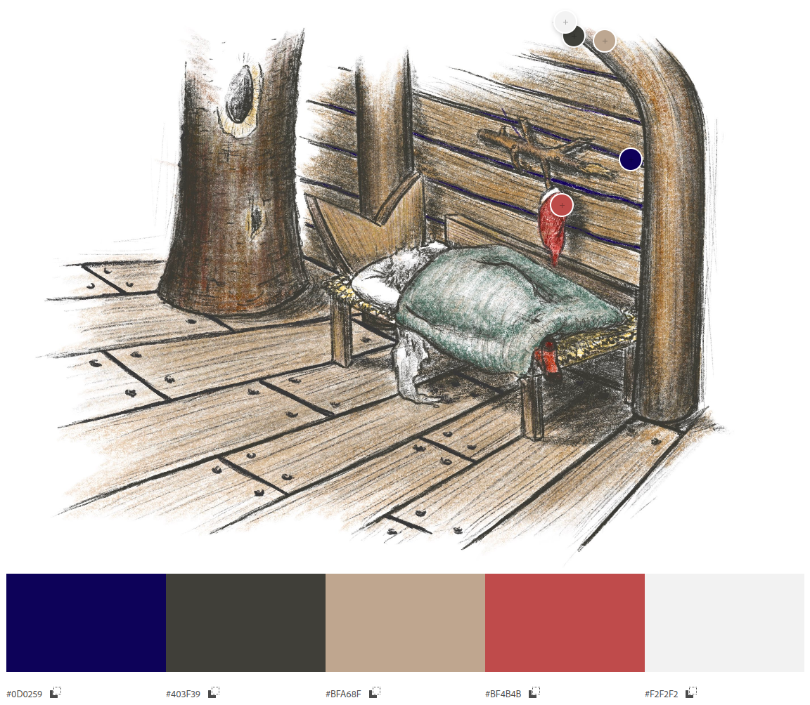

# Magic Forest Trail


[View the live project here.]()

The website has been created as for a associate of mine. The hiking trail is based in Braunwald, Glarus-Süd in the North East of Switzerland. Bartli is a well known mountain dwelling drawf, the fictitious character is based on a children's book. My associate wanted to provide a website to breathe new life into the trail, and attract more visitors during the summer and autumn months. 


---

# User Experience (UX)

* ## Intended Audience
    * First Time Visitor Goals
    * Return Vistor Goals
    * Frequent Viistor Goals

* ## User stories
    * Create content that is child appropriate
    * Create content for adults or parents with children
    * Provide easy access to routes
        * Show terrain (whether steep or steady climbs)
        * Show distances
        * Show approximate times
    * Provide details of how to get to destination
    * Provide a form
        * For people to book family passes in advance
        * To ask questions about the trail 

* ## Design
*Created a prototype for the site with Figma, [here](https://www.figma.com/file/6KQhxGl6q3N0ccFwV6UxXw/PP1?node-id=0%3A1&t=Qqr2DniHOcIOQmPK-1)*

* ### Designed mobile-first, so using min-width media queries in the code structure.


*[Adobe Color](https://color.adobe.com/create/image)*

    * ## Color Palette created from the Image Picker function on the [coolors.co](https://coolors.co/image-picker) website
    ```
    --redwood: hsla(3, 34%, 50%, 1);
    --dark-lava: hsla(31, 19%, 25%, 1);
    --davys-grey: hsla(39, 10%, 33%, 1);
    --feldgrau: hsla(156, 15%, 33%, 1);
    --white: hsla(0, 0%, 100%, 1);
    ```

# Technologies Used

## Languages Used
* HTML5
* CSS3

## Frameworks, Libraries and Programs Used
* Google Fonts
    * Google fonts was used to import the font to the style.css which is used on all pages throughout the project.
* Font Awesome
    * Font Awesome was used on all necessary pages throughout the website to add icons for aesthetic and UX purposes.
* Git
    * Git was used for version control by utilising the Gitpod terminal to commit to git and push to GitHub.
* GitHub
    * Github was used to store the project's code after being pushed from Git. 
* Figma


# Credit

## Code
* [Pawprint animation](https://designmodo.com/demo/stepscss/pawprints.html)

## Content
* [Visit Glarnerland](https://glarnerland.ch/de/map/detail/zwerg-bartli-erlebnisweg-9ff632fe-5eaf-45d9-a6ea-4d743635148f.html) 
* Character based on Der Zwerg Bartli by Lorly Jenny
* [Use of GeoJSON with Leaflet](https://leafletjs.com/examples/geojson/)

## Media
* Images kindly provided by Hermina 
* Pawprints by <a href="https://pixabay.com/users/b0red-4473488/?utm_source=link-attribution&amp;utm_medium=referral&amp;utm_campaign=image&amp;utm_content=2165814">b0red</a> from <a href="https://pixabay.com//?utm_source=link-attribution&amp;utm_medium=referral&amp;utm_campaign=image&amp;utm_content=2165814">Pixabay</a>
* Footprint by <a href="https://pixabay.com/users/openclipart-vectors-30363/?utm_source=link-attribution&amp;utm_medium=referral&amp;utm_campaign=image&amp;utm_content=155457">OpenClipart-Vectors</a> from <a href="https://pixabay.com//?utm_source=link-attribution&amp;utm_medium=referral&amp;utm_campaign=image&amp;utm_content=155457">Pixabay</a>

## Acknowledgements

### Todo
- [ ] IMAGE - Add image of site on different devices  

