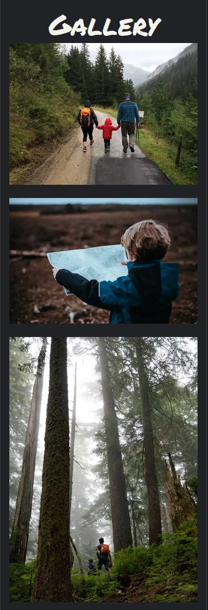

# Magic Forest Trail


[View the live project here.](https://halfpintutopia.github.io/magic-forest-trail/)

The website is a fan website and has been created solely for the course, but inpsired by an actual hiking trail based in Braunwald, Glarus-Süd in the North East of Switzerland. "Zwerg Bartli", a moutain dwelling drawf, is an affectionately well know character in this area. A fictitious character made famous by a children's book. 


---

## Table of contents
* [User Experience](#user-experience-ux)
  * [Intended Audience](#intended-audience)
  * [User Stories](#user-stories)

* [Design](#design)
  * [Wireframes](#wireframes)
  * [Colour Scheme](#colour-scheme)
  * [Typography](#typography)
  * [Imagery](#imagery)

* [Features](#features)
  * [General Features on Each Page](#general-features-on-each-page)
  * [Future Implementations](#future-implementations)
  * [Accessibility](#accessibility)

* [Technologies Used](#technologies-used)
  * [Languages Used](#languages-used)
  * [Frameworks, Libraries & Programs Used](#frameworks-libraries--programs-used)

* [Deployment & Local Development](#deployment--local-development)
  * [Deployment](#deployment)
  * [Local Development](#local-development)
    * [How to Fork](#how-to-fork)
    * [How to Clone](#how-to-clone)

* [Testing](#testing)

* [Credits](#credits)
  * [Code Used](#code-used)
  * [Content](#content)
  * [Media](#media)
  * [Acknowledgments](#acknowledgments)

---

# User Experience (UX)

Designed and developed mobile first. 

The idea of the website was inspired by a friend, Hermina ,Her family are very enthusiastic about the trail. She is very motivated in breathing a new breath of life into this attraction and wanted and I thought it would be a win-win to provide a basic website to get her personal project started.

## Intended Audience

* Parents with children
* Families
* Schools

---
* ## User stories
* Client Goals
    * Create content that is child appropriate
    * Create content for adults or parents with children
    * Provide easy access to routes
        * Show terrain (whether steep or steady climbs)
        * Show distances
        * Show approximate times to hike
        * Show difficulty level
    * Provide details of how to get to Braunwald by car or train
    * Provide a form
        * For people to book family passes in advance
        * To ask questions about the trail
        * To ask about other activities in the area
    * Provide a platform that boosts in tourism in the area
* First Time Visitor Goals
    * Find information about the trails
    * Find the out how to get to the start of the trails
    * Find information about the distance of the trails
    * Find variations of the trial
    * Find the difficulty / suitability of the trails
    * Be able to contact Braunwaldbahn, the company that provides the cable car sevice
    * See images of the trail
    * Share their photos on social media
* Return Vistor Goals
    * Try alternative routes
    * Try other activities provided in the area
    * Stay overnight in the accommodation provided in the area
    * Try other recommended activities in the local area
* Frequent Vistor Goals
    * Refer their friends, families and associates about the trail.


# Design

## Wireframes
Wireframes were created for the site with [Figma](https://www.figma.com).


*Wireframe for mobile and desktop*

<details>
<summary>Home page for mobile and desktop</summary>
<br>


*Landing page - mobile and desktop*
</details>
<br>

<details>
<summary>Trail list for mobile and desktop</summary>
<br>


*Trail list section - mobile and desktop*
</details>
<br>

<details>
<summary>Trail page for mobile and desktop</summary>
<br>


*Trail page - mobile and desktop*
</details>
<br>

<details>
<summary>Form view for mobile and desktop</summary>
<br>


*Form - mobile and desktop*
</details>
<br>

<details>
<summary>Form success page for mobile and desktop</summary>
<br>


*Form success page - mobile and desktop*
</details>
<br>

<details>
<summary>Header navigation and footer for mobile and desktop</summary>
<br>


*Header navigation and footer - mobile and desktop*
</details>
<br>

<details>
<summary>Page not found page for mobile and desktop</summary>
<br>


*Page not found page - mobile and desktop*
</details>
<br>

To see the full wireframe, view it [here](https://www.figma.com/file/mY6L1TpxKS6PupGlHRLvVF/PP1-Wireframe?node-id=0%3A1&t=29queejCZUsKPnX9-1).

--- 

## Colour Scheme

The colour palette should complement greens, to represent nature and the forest. The red was to represent Bartli's hat. 

Created colour palette using:
* [Adobe Color](https://color.adobe.com/create/image) 
* [coolors.co](https://coolors.co/image-picker).


Due to assessibility, the 

## Typography

Permanent Marker and Overpass Fonts chosen from [Google Fonts](https://fonts.google.com). Fonts were chosen to represent fun and playful as well as being clear easy to read.


## Imagery

The images match the theme of the site, hiking. Families with children on hiking activites.

# Features

## Specific features

<details>
<summary>Trail List</summary>
<br>


*Screenshot of the trail (lists) feature for mobile*

<br>


*Screenshot of the trail (lists) feature for desktop*

<br>

The trail list are displayed as cards. The text description length of each card depends on the size of the device. A class was added to to shorten the text, so that the card heights were not too tall on mobile devices. 

</details>
<br>

<details>
<summary>Gallery</summary>
<br>



*Screenshot of the gallery feature for mobile*

<br>


*Screenshot of the gallery feature for desktop*

<br>

The gallery is in a grid layout masonry style. The gallery was to suit and demonstrate images that are meant to be viewed in potrait or landscape.

</details>
<br>


## General features 

<details>
<summary>Call to action</summary>
<br>


*Screenshot of the cta feature for mobile*

<br>


*Screenshot of the cta feature for desktop*

<br>

The button link for the contact form is a floating element on the page. This was changed from the original wireframe, as wanted the CTA button to be visible whereever the user was on the page. Floating it made it visible and accessible for visitors to easily click. 

</details>

<br>

<details>
<summary>Text Image Sections (with & without quicklinks</summary>
<br>

Version 1


*Screenshot of the text image feature for mobile*

<br>


*Screenshot of the text image feature for desktop*

<br>

Version 2


*Screenshot of the text image with quicklinks feature for mobile*

<br>


*Screenshot of the text image with quicklinks feature for desktop*

<br>

There are two version of the text-image feature. 

The first one can be found on the home page. This is simple layout of image and text. When multiple image text sections are on the same page, they are set to be alternative sides. The text remains in a container and the image stretches to either the left or right side, dependendant on which side of the text it is positioned. This effect was to fill empty space on wider devices.

The second version is seen on the storybook page. The layout is exactly the same. The content is slightly different, as under each text, there is a link which enables the visitor to quickly go the trail page if they are interested to visit the place mentioned in the story. 

</details>

<br>

### Future implementations

1. Add SwissMobility API to show:
    * Show actual height
    * Show real distances
    * Show declines and inclines
    *  the ascent and descent
2. Connect Instagram API to enable hikers to share images


### Assessiblity

#### Fonts
#### Colours


#### Icons
#### Movement with keyboard tab

[](https://www.youtube.com/watch?v=jDDaOFr9nqQ)

## Technologies Used

### Languages Used
* HTML5
* CSS3
* JavaScript

## Frameworks, Libraries and Programs Used
* Google Fonts
    * Google fonts was used to import the font to the style.css which is used on all pages throughout the project.
* Font Awesome
    * Font Awesome was used on all necessary pages throughout the website to add icons for aesthetic and UX purposes.
* Git
    * Git was used for version control by utilising the Gitpod terminal to commit to git and push to GitHub.
* GitHub
    * Github was used to store the project's code after being pushed from Git.
* LeafletJS - [Use of GeoJSON with Leaflet](https://leafletjs.com/examples/geojson/)
* Figma

<br>

## Remote and Local Deployment

</details>
<br>

<details>
<summary>Remote deployment</summary>
<br>

https://user-images.githubusercontent.com/30613818/205482822-4c33545b-8b52-4a2b-9212-0e119214ff22.mov


*Screencast of deployment*

<br>

1. Go to repository
2. Click Settings tab
3. Click on Pages in the left hand menu, under Code and automation 
   *Screenshot of how to get the Pages section*

4. Under Build and deployment > Source ensure Deploy from a branch is selected 
   *Screenshot of source option*

5. Under Build and deploment > Branch select main branch 
   *Screenshot of branch option*

6. Click save
7. It may take more than a few minutes, but when the page has been created, you will see the following success message 
   *Screenshot of success message*

</details>
<br>


<details>
<summary>How to Clone</summary>

<br>

To contribute to my code, you can fork the repository.

1. To fork click on the Fork button in the top left corner of the page. 
2. Fill in the form with either keep the name or create a new name for the repository 

<br>

To run the application type the following into your terminal:

```bash
python3 -m http.server
```
<br>

</details>
<br>

<details>
<summary>How to Fork</summary>

<br>

To contribute to my code, you can fork the repository.

1. To fork click on the Fork button in the top left corner of the page. 
2. Fill in the form with either keep the name or create a new name for the repository 

<br>

To run the application type the following into your terminal:

```bash
python3 -m http.server
```
<br>

</details>
<br>


# Testing

Browserstack was used for testing. Devices selected were:
* Windows
    * Firefox 108 on Windows 11
    * Chrome 108 on Windows 11
* Apple
    * Ventura Safari 16
* Android
    * Chrome Galaxy S22
* Apple iOS
    * Safari iPHone SE 2022

## User experience

<details>
<summary>Client Goals Testing</summary>
<br>

| Client goal | Implementation | Tested | Successful |
| ------------- |:-------------:|:-----:|:-----:|
| Provide content that is child appropriate | The content was child-friendly | Yes | Yes |
| Provide content for adults or parents with children | The content is descriptive yet simple  | Yes | Yes |
| Provide easy access to routes |  Trail list navigated to via the nav bar. Quick links added to the Storybook page | Yes | Yes |
| Inform visitors of trail distances | Trail details, distances easily seen on the top of the page  | Yes | Yes |
| Inform visitors of approximate times to hike trail | Trail details, approximate times easily seen on the top of the page  | Yes | Yes |
| Inform visitors of difficulty levels | Trail details, difficulty levels easily seen on the top of the page  | Yes | Yes |
| Provide a booking form | Accessible via the CTA button show on all pages  | Yes | Yes |
| Provide a form which allows users to book family passes in advance | Text | Yes | Yes |
| Provide a form for users to ask question about the trail | Text | Yes | Yes |
| Provide a form for users to ask about other activities in the area | Text | Yes | Yes |
| Provide a platform that boosts in tourism in the area | Text | Yes | Yes |

| Inform visitors of how to get to Braunwald by car or train | Text  | Yes | Yes |


</details>
<br>

<details>
<summary>First Time Visitor Goals</summary>
<br>

| First Time Visitor Goals | Implementation | Tested | Successful |
| ------------- |:-------------:|:-----:|:-----:|
| Find information about the trails | Text  | Yes | Yes |
| Find the out how to get to the start of the trails | Text  | Yes | Yes |
| Find information about the distance of the trails | Text  | Yes | Yes |
| Find variations of the trial | Text  | Yes | Yes |
| Find the difficulty / suitability of the trails | Text  | Yes | Yes |
| Be able to contact Braunwaldbahn, the company that provides the cable car sevice | Text  | Yes | Yes |
| See images of the trail | Text  | Yes | Yes |
| Share their photos on social media | Text  | Yes | Yes |

</details>
<br>

<details>
<summary>Return Visitor Goals</summary>
<br>

| Return Vistor Goals | Implementation | Tested | Successful |
| ------------- |:-------------:|:-----:|:-----:|
| Try alternative routes | Text  | Yes | Yes |
| Try other activities provided in the area | Text  | Yes | Yes |
| Stay overnight in the accommodation provided in the area | Text  | Yes | Yes |
| Try other recommended activities in the local area | Text  | Yes | Yes |
| Find the difficulty / suitability of the trails | Text  | Yes | Yes |
| Be able to contact Braunwaldbahn, the company that provides the cable car sevice | Text  | Yes | Yes |
| See images of the trail | Text  | Yes | Yes |
| Share their photos on social media | Text  | Yes | Yes |

</details>
<br>

<details>
<summary>Frequent Vistor Goals</summary>
<br>

| Frequent Vistor Goals | Implementation | Tested | Successful |
| ------------- |:-------------:|:-----:|:-----:|
| Refer their friends, families and associates about the trail | Text  | Yes | Yes |

</details>
<br>

<details>
<summary>Bugs and fixes</summary>
<br>

|Bug / Errors | Where / Location site | Browser | Device | Remarks | Mode (light / dark) | Fixed | Solution |
|-------------|-----------------------|---------|--------|---------|:-------------------:|:-----:|----------|
| Fields in form not visible | contact form | Chrome, Firefox | Apple Laptop| | dark | Yes | Change line colors for field. Applied color for dark and light mode |
| Only adults and kids visible (missing: first name, last name, email, telephone)| contact form | Chrome | Apple Laptop | | dark | Yes | Change font color to suit dark and light mode |
| Arrows to add / sub adults / kids only visible on mouse over | contact form | Chrome | Apple Laptop | | dark | | No | Arrow color are determined by the browser |
| Reference * not visible (bottom of the page) | contact form | Chrome | Apple Laptop | actually there are * but they are at form fields marking mandatory entries, slightly confusing | dark | | Yes | Removed the reference as it was not relevant to the content |
| Social media icons go white (on white) therefore not visible on mouse over everywhere / every page | Chrome, Firefox | Apple Laptop| | dark | | Yes | Changed the icon colors in the footer |
| Twitter link typo - redirects to "twiiter" instead of "twitter" | everywhere / every page | Chrome, Firefox | Apple Laptop | | dark | Yes | Corrected typos |
| Text box / frame of text box not visible | contact form | Chrome, Firefox | Apple Laptop| | dark | Yes | Added border to textarea field. Applied color for both dark and light mode |
| Image not loading | full trail | Chrome, Firefox | Apple Laptop| | dark | Yes | Fixed the broken link by correcting the relative path |
| Zoom / pan on map does not include all dwarfs only top half | every trail page | Chrome | Apple Laptop | | dark | Yes | Added bounds to the leaflet map, to center the map according to all markers |
| Shorten text on first story (size is off in comparison to the next story bits) not a bug, just looking off | storybook | Chrome, Firefox | Apple Laptop| | dark | Yes | The text remains the same, but changed spacing on the text image grid areas |
| Links either labelled wrong or wrong links set (Trail option 3 leads to variation 1 etc.) | storybook | Chrome, Firefox | Apple Laptop | see sheet 2 for details | dark | Yes | Fixed links to suit the actual href |
| When going back from trail page to storybook, last chosen trail option is marked in green instead of red. nice but not sure if intentional. does not happen in Chrome only ff | storybook | Firefox | Apple Laptop | | dark | No | |
| Book your family pass blocks scroll down text and animation | home | Chrome | Android mobile | lots of room above magic forest trail | dark |
| Book your family pass goes into hiding when scrolled to position of any header. nice but not sure if intentional | home | Chrome | Android mobile | | dark | 
| Social media icon stays white when going back to home after clicking them | everywhere / every page | Chrome | Android mobile | | dark |
| Image not loading | full trail | Chrome | Android mobile | | dark | Yes | Fixed the broken link by correcting the relative path |
| Book your family pass seemingly jumps around randomly when scrolling | all trail pages | Chrome | Android mobile | | dark |
| Book your family pass snaps back down after scrolling up from the bottom of the page | storybook | Chrome | Android mobile | | dark |
| Little arrow to expand / collapse above adults doesn't do anything | contact form| Chrome, Firefox | Apple Laptop | | light |
| Form error display. When trying to book 458 adults it tells me i can only book 10. when i want to book 55 children no error messages displays, same for incorrect email adress | contact form | Chrome | Android mobile || light |
| Form error display. Notifies correctly about number of adults and children allowed, but lets me inout incorrect email address| contact form| Chrome| Apple Laptop | | dark|
| After filling a form in once. the second load of the contact form page displays lines for name, last name etc and the box for additional comments when before there were no lines / box visible | contact form | Chrome | Apple Laptop | | dark |
| Little arrow above adults is not visible | contact form | Chrome | Apple Laptop | | dark |
| Arrows to add / sub adults stops at ten (which is max). manual inputs does not automatically resets bigger numbers than 10 to 10 | contact form | Chrome | Apple Laptop | | dark |
| Error form display in Chrome does not always notify about wrong inputs. Firefox tells you correctly which input is wrong | contact form | Chrome | Apple Laptop | | dark |
| Neither the labels nor the placeholder texts are visible at the first name, last name, email and phone number inputs | contact form |  |  |  | dark | Yes | Make placeholders visible by changing the default opacity to 1 for input placeholders |
| Zoom out of your maps more than the max size of the maps are | All trail pages |  |  |  |  | Yes | Set a min and max zoom on the leaflet map |

---

Additional images / videos


https://user-images.githubusercontent.com/30613818/208293996-427c7401-a60a-47dc-bd0f-677ca0110535.mp4


</details>
<br>


### Lighthouse

#### Light Mode

#### Dark

### Validator Testing

#### HTML W3 Validator

#### CSS Validator

## Credits

### Code Used

### Content

The content for 

### Media

## Media
### Compression


Font sizes, margins and paddings were calculated using ```clamp()```, to make the site responsive without having to create media queries.[[2]][[[3]]]

* Images kindly provided by Hermina


Font sizing was not being responsive, used clamp()
Color scheme fitting the 70/20/10 ratio, there were too much
Slow loading images use loading lazy and https://www.freecodecamp.org/news/a-guide-to-responsive-images-with-ready-to-use-templates-c400bd65c433/


[Kevin Powell - Most sites have a "hidden" link, and yours should too!](https://www.youtube.com/watch?v=jDDaOFr9nqQ)


* [An image format for the Web](https://developers.google.com/speed/webp)
* [A Guide to Responsive Images with Ready-to-Use Templates](https://medium.com/free-code-camp/a-guide-to-responsive-images-with-ready-to-use-templates-c400bd65c433)

Wanted to use webp images due to the size which if too large would slow down the site. Also, added the ```lazy-loading``` attribute.

#### Homepage

<details>
<summary>
<br>

* [Green Trees on Brown Soil photo by Nouman Raees from Pexels](https://www.pexels.com/photo/green-trees-on-brown-soil-3670681/)
* Footprint by <a href="https://pixabay.com/users/openclipart-vectors-30363/?utm_source=link-attribution&amp;utm_medium=referral&amp;utm_campaign=image&amp;utm_content=155457">OpenClipart-Vectors</a> from <a href="https://pixabay.com//?utm_source=link-attribution&amp;utm_medium=referral&amp;utm_campaign=image&amp;utm_content=155457">Pixabay</a>

The footprints were created from using GIMP to manipulate the image, and then the SVG was created with Inkscape. 


* [Two Girls Sitting on Brown Bench Near Body of Water photo by Susanne Jutzeler, suju-foto](https://www.pexels.com/photo/two-girls-sitting-on-brown-bench-near-body-of-water-1292006/)

</summary>
</details>
<br>

#### Trail list and Trail 

<details>
<summary>
<br>


</summary>
</details>
<br>

#### Storybook

<details>
<summary>Images used for the Storybook page</summary>
<br>

* [Children and adults hiking on a trail in the mountains photo from Unsplash](https://unsplash.com/photos/FSdsaiuRNfc) by <a href="https://unsplash.com/@greg_rosenke?utm_source=unsplash&utm_medium=referral&utm_content=creditCopyText">Greg Rosenke</a> on <a href="https://unsplash.com/s/photos/free-hiking-family-mountains?utm_source=unsplash&utm_medium=referral&utm_content=creditCopyText">Unsplash</a>
* [Girl journalling on a rocky surface](https://unsplash.com/photos/q-motCAvPBM) by <a href="https://unsplash.com/@nixcreative?utm_source=unsplash&utm_medium=referral&utm_content=creditCopyText">Tyler Nix</a> on <a href="https://unsplash.com/s/photos/hiking-family-mountains?utm_source=unsplash&utm_medium=referral&utm_content=creditCopyText">Unsplash</a>
* [Family and dog going down the mountain](https://unsplash.com/photos/7MrXw_o7Eo4) by <a href="https://unsplash.com/@souvenirpixels?utm_source=unsplash&utm_medium=referral&utm_content=creditCopyText">James Wheeler</a> on <a href="https://unsplash.com/s/photos/hiking-family-mountains?utm_source=unsplash&utm_medium=referral&utm_content=creditCopyText">Unsplash</a>
* [Boy climbing up rocky steps](https://unsplash.com/photos/t9VI_OSaErI) by <a href="https://unsplash.com/@mael_balland?utm_source=unsplash&utm_medium=referral&utm_content=creditCopyText">Mael BALLAND</a> on <a href="https://unsplash.com/s/photos/family-hiking?utm_source=unsplash&utm_medium=referral&utm_content=creditCopyText">Unsplash</a>
* [Sun rays beating down on mother and daughter walking in forest](https://unsplash.com/photos/RRZM3cwS1DU) by <a href="https://unsplash.com/@souvenirpixels?utm_source=unsplash&utm_medium=referral&utm_content=creditCopyText">James Wheeler</a> on <a href="https://unsplash.com/s/photos/hiking-family-mountains?utm_source=unsplash&utm_medium=referral&utm_content=creditCopyText">Unsplash</a>
* [Boy walking up alpine hiking trail path](https://unsplash.com/photos/DgSRu6944ZQ) by <a href="https://unsplash.com/@morganddl?utm_source=unsplash&utm_medium=referral&utm_content=creditCopyText">Morgan David de Lossy</a> on <a href="https://unsplash.com/s/photos/children-hiking?utm_source=unsplash&utm_medium=referral&utm_content=creditCopyText">Unsplash</a>


* Photo by <a href="https://unsplash.com/@markusspiske?utm_source=unsplash&utm_medium=referral&utm_content=creditCopyText">Markus Spiske</a> on <a href="https://unsplash.com/s/photos/children-hiking?utm_source=unsplash&utm_medium=referral&utm_content=creditCopyText">Unsplash</a>

  
</details>
<br>

#### Gallery

<details>
<summary>Images used for the Gallery page</summary>
<br>

* [Two boys hiking through tall trees in forest](https://unsplash.com/photos/e3PQpLM_SGo) by <a href="https://unsplash.com/@greg_rosenke?utm_source=unsplash&utm_medium=referral&utm_content=creditCopyText">Greg Rosenke</a> on <a href="https://unsplash.com/s/photos/kids-hiking-adventure?utm_source=unsplash&utm_medium=referral&utm_content=creditCopyText">Unsplash</a>
* [Man carrying child](https://unsplash.com/photos/nzUHrjz4wu4) by <a href="https://unsplash.com/@katiemoum?utm_source=unsplash&utm_medium=referral&utm_content=creditCopyText">Katie Moum</a> on <a href="https://unsplash.com/s/photos/kids-hiking-adventure?utm_source=unsplash&utm_medium=referral&utm_content=creditCopyText">Unsplash</a>


</details>
<br>


<details>
<summary>Images used for the Trail List and individual Trail Pages</0summary>
<br>

* [White-Red-White Hiking flag painted on rock](https://unsplash.com/photos/ZIFccT5-36Y) by <a href="https://unsplash.com/@giger_00?utm_source=unsplash&utm_medium=referral&utm_content=creditCopyText">Curdin Giger</a> on <a href="https://unsplash.com/s/photos/hiking-switzerland?utm_source=unsplash&utm_medium=referral&utm_content=creditCopyText">Unsplash</a>
* [View of the view with the mountain as the backdrop](https://unsplash.com/photos/FNaFLvbLFuk) by <a href="https://unsplash.com/@chris_regg?utm_source=unsplash&utm_medium=referral&utm_content=creditCopyText">Christian Regg</a> on <a href="https://unsplash.com/s/photos/hiking-switzerland?utm_source=unsplash&utm_medium=referral&utm_content=creditCopyText">Unsplash</a>
* [View from the path that leads to the lake](https://unsplash.com/photos/guc520jc0lk) by <a href="https://unsplash.com/@mamuej?utm_source=unsplash&utm_medium=referral&utm_content=creditCopyText">Marc</a> on <a href="https://unsplash.com/s/photos/hiking-switzerland?utm_source=unsplash&utm_medium=referral&utm_content=creditCopyText">Unsplash</a>
* [View of mountain and valley below](https://unsplash.com/photos/NaEIPJ51EHE) by <a href="https://unsplash.com/@bladeoftree?utm_source=unsplash&utm_medium=referral&utm_content=creditCopyText">Marco Meyer</a> on <a href="https://unsplash.com/s/photos/hiking-switzerland?utm_source=unsplash&utm_medium=referral&utm_content=creditCopyText">Unsplash</a>
* [View from the top of the mountain](https://unsplash.com/photos/NaEIPJ51EHE) by <a href="https://unsplash.com/@msafwat?utm_source=unsplash&utm_medium=referral&utm_content=creditCopyText">Mohammed Abdullatif</a> on <a href="https://unsplash.com/s/photos/hiking-switzerland?utm_source=unsplash&utm_medium=referral&utm_content=creditCopyText">Unsplash</a>
* [Swiss Alps in the middle of summer on a sunny day](https://unsplash.com/photos/fZsIcej_bQA) by <a href="https://unsplash.com/@allphotobangkok?utm_source=unsplash&utm_medium=referral&utm_content=creditCopyText">Paul Szewczyk</a> on <a href="https://unsplash.com/s/photos/hiking-switzerland?utm_source=unsplash&utm_medium=referral&utm_content=creditCopyText">Unsplash</a>

</details>
<br>


### Acknowledgements
Acknowledgement goes to aweseome people who supported, advised and basically put up with a lot of .
Rahul
Stefan Tschudi
hermina
For the support on slack epecially Ger Tobin, who suggested using Leaflet and Szilvia Csernus, for reviewing my project


#### List of references
[How gestures are shaping the future of UX
](https://uxdesign.cc/how-gestures-are-shaping-the-future-of-ux-ce2c9e6d7a9f)

#### References
[How gestures are shaping the future of UX
]: https://uxdesign.cc/how-gestures-are-shaping-the-future-of-ux-ce2c9e6d7a9f
[min(), max(), and clamp(): three logical CSS functions to use today]: (https://web.dev/min-max-clamp/)
[Modern Fluid Typography Using CSS Clamp]: (https://www.smashingmagazine.com/2022/01/modern-fluid-typography-css-clamp/)
[RFS]: (https://github.com/twbs/rfs#installation)
* [Visit Glarnerland](https://glarnerland.ch/de/map/detail/zwerg-bartli-erlebnisweg-9ff632fe-5eaf-45d9-a6ea-4d743635148f.html)
* Character based on Der Zwerg Bartli by Lorly Jenny

* [Box shadows](https://www.cssmatic.com/box-shadow)
* [CSS Tricks - HTML Picture](https://css-tricks.com/a-guide-to-the-responsive-images-syntax-in-html/#using-picture)
* [Web Dev - Browser level image lazy loading](https://web.dev/browser-level-image-lazy-loading/)
* [Editorx - Font size](https://www.editorx.com/shaping-design/article/font-size)
* [Utopia - Responsive font and space sizing](https://utopia.fyi)
* [](https://www.freecodecamp.org/news/a-guide-to-responsive-images-with-ready-to-use-templates-c400bd65c433/)
* [](https://www.freecodecamp.org/news/the-100-correct-way-to-do-css-breakpoints-88d6a5ba1862)
* [Inkscape](https://inkscape.org/)
* [GIMP](https://www.gimp.org/)
* [Font Awesome](https://fontawesome.com)
* [SVGator](https://app.svgator.com)

#### Resources

* Fonts
    * [](https://matthewjamestaylor.com/responsive-font-size)
    * [Font Awesome](https://fontawesome.com)
* Flexbox
    * [](https://css-tricks.com/snippets/css/a-guide-to-flexbox/)
* Styles


