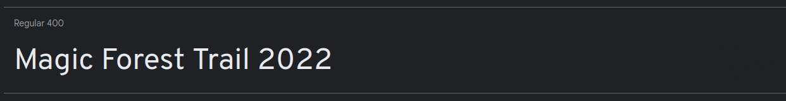

# Magic Forest Trail


[View the live project here.](https://halfpintutopia.github.io/magic-forest-trail/)

The website has been created solely for the course, but inpsired by an actual hiking trail based in Braunwald, Glarus-Süd in the North East of Switzerland. "Zwerg Bartli", a moutain dwelling drawf, is an affectionately well know character in this area. A fictitious character   made famous by a children's book.  The idea of the website came about, when a colleague, Hermina, enthused about the trail and taking her children to it. She is very motivated in breathing a new breath of life into this attraction and wanted and I thought it would be a win-win to provide a basic website to get her personal project started.


---

## Table of contents
* [User Experience](#user-experience-ux)
  * [Intended Audience](#user-audience)
  * [User Stories](#user-stories)

* [Design](#design)
  * [Colour Scheme](#colour-scheme)
  * [Typography](#typography)
  * [Imagery](#imagery)
  * [Wireframes](#wireframes)

* [Features](#features)
  * [General Features on Each Page](#general-features-on-each-page)
  * [Future Implementations](#future-implementations)
  * [Accessibility](#accessibility)

* [Technologies Used](#technologies-used)
  * [Languages Used](#languages-used)
  * [Frameworks, Libraries & Programs Used](#frameworks-libraries--programs-used)

* [Deployment & Local Development](#deployment--local-development)
  * [Deployment](#deployment)
  * [Local Development](#local-development)
    * [How to Fork](#how-to-fork)
    * [How to Clone](#how-to-clone)

* [Testing](#testing)

* [Credits](#credits)
  * [Code Used](#code-used)
  * [Content](#content)
  * [Media](#media)
  * [Acknowledgments](#acknowledgments)


---

# User Experience (UX)

## Intended Audience

* Parents with children
* Families
* Schools

---
* ## User stories
* Client Goals
    * Create content that is child appropriate
    * Create content for adults or parents with children
    * Provide easy access to routes
        * Show terrain (whether steep or steady climbs)
        * Show distances
        * Show approximate times to hike
        * Show difficulty level
    * Provide details of how to get to Braunwald by car or train
    * Provide a form
        * For people to book family passes in advance
        * To ask questions about the trail
        * To ask about other activities in the area
    * Provide a platform that boosts in tourism in the area
* First Time Visitor Goals
    * Find information about the trails
    * Find the out how to get to the start of the trails
    * Find information about the distance of the trails
    * Find variations of the trial
    * Find the difficulty / suitability of the trails
    * Be able to contact Braunwaldbahn, the company that provides the cable car sevice
    * See images of the trail
    * Share their photos on social media
* Return Vistor Goals
    * Try alternative routes
    * Try other activities provided in the area
    * Stay overnight in the accommodation provided in the area
    * Try other recommended activities in the local area
* Frequent Vistor Goals
    * Refer their friends, families and associates about the trail.


## Design
Wireframes were created for the site with [Figma](https://www.figma.com).


*Wireframe for mobile and desktop*

<details>
<summary>Home page for mobile and desktop</summary>
<br>


*Landing page - mobile and desktop*
</details>
<br>

<details>
<summary>Trail list for mobile and desktop</summary>
<br>


*Trail list section - mobile and desktop*
</details>
<br>

<details>
<summary>Trail page for mobile and desktop</summary>
<br>


*Trail page - mobile and desktop*
</details>
<br>

<details>
<summary>Form view for mobile and desktop</summary>
<br>


*Form - mobile and desktop*
</details>
<br>

<details>
<summary>Form success page for mobile and desktop</summary>
<br>


*Form success page - mobile and desktop*
</details>
<br>

<details>
<summary>Header navigation and footer for mobile and desktop</summary>
<br>


*Header navigation and footer - mobile and desktop*
</details>
<br>

<details>
<summary>Page not found page for mobile and desktop</summary>
<br>


*Page not found page - mobile and desktop*
</details>
<br>

To see the full wireframe, view it [here](https://www.figma.com/file/mY6L1TpxKS6PupGlHRLvVF/PP1-Wireframe?node-id=0%3A1&t=29queejCZUsKPnX9-1).

--- 

### Colour Scheme


*[Adobe Color](https://color.adobe.com/create/image)*

---


    ```
    --black-olive: hsla(45, 7%, 22%, 1);
    --davys-grey: hsla(39, 10%, 33%, 1);
    --jet: hsla(320, 2%, 25%, 1);
    --white: hsla(0, 0%, 100%, 1);
    --timberwolf: hsla(36, 14%, 86%, 1);
    ```
*Color Palette created from the Image Picker function on the [coolors.co](https://coolors.co/image-picker) website*

### Typography

Permanent Marker and Overpass Fonts chosen from [Google Fonts](https://fonts.google.com)





The font was chosen to be playful and clear. 

### Imagery

The images match the theme of the site, hiking. Families with children on hiking activites.

## Features

### Specific features

<details>
<summary>Trail List</summary>
<br>


*Screenshot of the trail (lists) feature for mobile*

<br>


*Screenshot of the trail (lists) feature for desktop*

</details>
<br>

<details>
<summary>Gallery</summary>
<br>


*Screenshot of the gallery feature for mobile*

<br>


*Screenshot of the gallery feature for desktop*

</details>
<br>


### General features 

<details>
<summary>Call to action</summary>
<br>


*Screenshot of the cta feature for mobile*

<br>


*Screenshot of the cta feature for desktop*

</details>


### Future implementations

1. Add SwissMobility API to show:
    * Show actual height
    * Show real distances
    * Show declines and inclines
    *  the ascent and descent
2. Connect Instagram to enable hikers to share images


### Assessiblity

#### Fonts
#### Colours
#### Icons
#### Movement with keyboard tab

[](https://www.youtube.com/watch?v=jDDaOFr9nqQ)

## Technologies Used

### Languages Used
* HTML5
* CSS3
* JavaScript

## Frameworks, Libraries and Programs Used
* Google Fonts
    * Google fonts was used to import the font to the style.css which is used on all pages throughout the project.
* Font Awesome
    * Font Awesome was used on all necessary pages throughout the website to add icons for aesthetic and UX purposes.
* Git
    * Git was used for version control by utilising the Gitpod terminal to commit to git and push to GitHub.
* GitHub
    * Github was used to store the project's code after being pushed from Git.
* LeafletJS - [Use of GeoJSON with Leaflet](https://leafletjs.com/examples/geojson/)
* Figma

<br>

## Remote and Local Deployment

https://user-images.githubusercontent.com/30613818/205482822-4c33545b-8b52-4a2b-9212-0e119214ff22.mov


*Screencast of deployment*

<br>


1. Go to repository
2. Click Settings tab
3. Click on Pages in the left hand menu, under Code and automation 
   *Screenshot of how to get the Pages section*

4. Under Build and deployment > Source ensure Deploy from a branch is selected 
   *Screenshot of source option*

5. Under Build and deploment > Branch select main branch 
   *Screenshot of branch option*

6. Click save
7. It may take more than a few minutes, but when the page has been created, you will see the following success message 
   *Screenshot of success message*

### How to Fork
To contribute to my code, you can fork the repository.

1. To fork click on the Fork button in the top left corner of the page. 
2. Fill in the form with either keep the name or create a new name for the repository 

### How to Clone


To run the application type the following into your terminal:

```bash
python3 -m http.server
```
<br>

## Testing
### User experience

<details>
<summary>Client Goals Testing</summary>
<br>

| Client goal | Implementation | Tested | Successful |
| ------------- |:-------------:|:-----:|:-----:|
| Provide content that is child appropriate | Text  | Yes | Yes |
| Provide content for adults or parents with children | Text  | Yes | Yes |
| Provide easy access to routes | Text  | Yes | Yes |
| Inform visitors of terrain (whether steep or steady climbs) | Text  | Yes | Yes |
| Inform visitors of trail distances | Text  | Yes | Yes |
| Inform visitors of approximate times to hike trail | Text  | Yes | Yes |
| Inform visitors of difficulty levels | Text  | Yes | Yes |
| Inform visitors of how to get to Braunwald by car or train | Text  | Yes | Yes |
| Provide a booking form | Text  | Yes | Yes |
| Provide a form which allows users to book family passes in advance | Text | Yes | Yes |
| Provide a form for users to ask question about the trail | Text | Yes | Yes |
| Provide a form for users to ask about other activities in the area | Text | Yes | Yes |
| Provide a platform that boosts in tourism in the area | Text | Yes | Yes |

</details>
<br>

<details>
<summary>First Time Visitor Goals</summary>
<br>

| First Time Visitor Goals | Implementation | Tested | Successful |
| ------------- |:-------------:|:-----:|:-----:|
| Find information about the trails | Text  | Yes | Yes |
| Find the out how to get to the start of the trails | Text  | Yes | Yes |
| Find information about the distance of the trails | Text  | Yes | Yes |
| Find variations of the trial | Text  | Yes | Yes |
| Find the difficulty / suitability of the trails | Text  | Yes | Yes |
| Be able to contact Braunwaldbahn, the company that provides the cable car sevice | Text  | Yes | Yes |
| See images of the trail | Text  | Yes | Yes |
| Share their photos on social media | Text  | Yes | Yes |

</details>
<br>

<details>
<summary>Return Visitor Goals</summary>
<br>

| Return Vistor Goals | Implementation | Tested | Successful |
| ------------- |:-------------:|:-----:|:-----:|
| Try alternative routes | Text  | Yes | Yes |
| Try other activities provided in the area | Text  | Yes | Yes |
| Stay overnight in the accommodation provided in the area | Text  | Yes | Yes |
| Try other recommended activities in the local area | Text  | Yes | Yes |
| Find the difficulty / suitability of the trails | Text  | Yes | Yes |
| Be able to contact Braunwaldbahn, the company that provides the cable car sevice | Text  | Yes | Yes |
| See images of the trail | Text  | Yes | Yes |
| Share their photos on social media | Text  | Yes | Yes |

</details>
<br>

<details>
<summary>Frequent Vistor Goals</summary>
<br>

| Frequent Vistor Goals | Implementation | Tested | Successful |
| ------------- |:-------------:|:-----:|:-----:|
| Refer their friends, families and associates about the trail | Text  | Yes | Yes |

</details>
<br>

<details>
<summary>Bugs and fixes</summary>
<br>

| Bugs / Errors | Cause | Fixed  |
| ------------- |:-------------:| -----:|
| Footer assessibility | Color of footer icons, on hover were the same as the color of the background color of the footer | Yes |
| col 2 is      | centered      |   $12 |
| zebra stripes | are neat      |    $1 |

| bug                                                                                                                                                                                               | where                   | browser         | device       | remarks                                                                                        | light / dark |
|---------------------------------------------------------------------------------------------------------------------------------------------------------------------------------------------------|-------------------------|-----------------|--------------|------------------------------------------------------------------------------------------------|--------------|
| Fields in form not visible                                                                                                                                                                        | book your pass          | chrome, firefox | macbook pro  |                                                                                                | dark mode    |
| only adults and kids visible (missing: first name, last name, email, telephone)                                                                                                                   | book your pass          | chrome          | macbook pro  |                                                                                                | dark mode    |
| Arrows to add / sub adults / kids only visible on mouse over                                                                                                                                      | book your pass          | chrome          | macbook pro  |                                                                                                | dark mode    |
| Reference * not visible (bottom of the page)                                                                                                                                                      | book your pass          | chrome          | macbook pro  | actually there are * but they are at form fields marking mandatory entries, slightly confusing | dark mode    |
| Social media icons go white (on white) therefore not visible on mouse over                                                                                                                        | everywhere / every page | chrome, firefox | macbook pro  |                                                                                                | dark mode    |
| twitter link typo - redirects to twiiter instead of twitter                                                                                                                                       | everywhere / every page | chrome, firefox | macbook pro  |                                                                                                | dark mode    |
| Text box / frame of text box not visible                                                                                                                                                          | book your pass          | chrome, firefox | macbook pro  |                                                                                                | dark mode    |
| image not loading                                                                                                                                                                                 | full trail              | chrome, firefox | macbook pro  |                                                                                                | dark mode    |
| zoom / pan on map does not include all dwarfs only top half                                                                                                                                       | every trail page        | chrome          | macbook pro  |                                                                                                | dark mode    |
| shorten text on first story (size is off in comparison to the next story bits) not a bug, just looking off                                                                                        | storybook               | chrome, firefox | macbook pro  |                                                                                                | dark mode    |
| links either labelled wrong or wrong links set (Trail option 3 leads to variation 1 etc.)                                                                                                         | storybook               | chrome, firefox | macbook pro  | see sheet 2 for details                                                                        | dark mode    |
| when going back from trail page to storybook, last chosen trail option is marked in green instead of red. nice but not sure if intentional. does not happen in chrome only ff                     | storybook               | firefox         | macbook pro  |                                                                                                | dark mode    |
| book your family pass blocks scroll down text and animation                                                                                                                                       | home                    | chrome          | xiaomi mi9se | lots of room above magic forest trail                                                          | dark mode    |
| book your family pass goes into hiding when scrolled to position of any header. nice but not sure if intentional                                                                                  | home                    | chrome          | xiaomi mi9se |                                                                                                | dark mode    |
| social media icon stays white when going back to home after clicking them                                                                                                                         | everywhere / every page | chrome          | xiaomi mi9se |                                                                                                | dark mode    |
| image not loading                                                                                                                                                                                 | full trail              | chrome          | xiaomi mi9se |                                                                                                | dark mode    |
| book your family pass seemingly jumps around randomly when scrolling                                                                                                                              | all trail pages         | chrome          | xiaomi mi9se |                                                                                                | dark mode    |
| book your family pass snaps back down after scrolling up from the bottom of the page                                                                                                              | storybook               | chrome          | xiaomi mi9se |                                                                                                | dark mode    |
| little arrow to expand / collapse above adults doesn't do anything                                                                                                                                | book your pass          | chrome, firefox | macbook pro  |                                                                                                | light mode   |
| Form error display. When trying to book 458 adults it tells me i can only book 10. when i want to book 55 children no error messages displays, same for incorrect email adress                    | book your pass          | chrome          | xiaomi mi9se |                                                                                                | light mode   |
| Form error display. Notifies correctly about number of adults and children allowed, but lets me inout incorrect email address                                                                     | book your pass          | chrome          | macbook pro  |                                                                                                | dark mode    |
| after filling a form in once. the second load of the book your pass page displays lines for name, last name etc and the box for additional comments when before there were no lines / box visible | book your pass          | chrome          | macbook pro  |                                                                                                | dark mode    |
| little arrow above adults is not visible                                                                                                                                                          | book your pass          | chrome          | macbook pro  |                                                                                                | dark mode    |
| arrows to add / sub adults stops at ten (which is max). manual inputs does not automatically resets bigger numbers than 10 to 10                                                                  | book your pass          | chrome          | macbook pro  |                                                                                                | dark mode    |
| error form display in chrome does not always notify about wrong inputs. firefox tells you correctly which input is wrong                                                                          | book your pass          | chrome          | macbook pro  |                                                                                                | dark mode    |


</details>
<br>


### Lighthouse

#### Light Mode

#### Dark

### Validator Testing

#### HTML W3 Validator

#### CSS Validator

## Credits

### Code Used

### Content

### Media

#### Storybook

<details>
<summary>Images used for the Storybook page</summary>
<br>

* Photo by <a href="https://unsplash.com/@greg_rosenke?utm_source=unsplash&utm_medium=referral&utm_content=creditCopyText">Greg Rosenke</a> on <a href="https://unsplash.com/s/photos/free-hiking-family-mountains?utm_source=unsplash&utm_medium=referral&utm_content=creditCopyText">Unsplash</a>
* Photo by <a href="https://unsplash.com/@souvenirpixels?utm_source=unsplash&utm_medium=referral&utm_content=creditCopyText">James Wheeler</a> on <a href="https://unsplash.com/s/photos/hiking-family-mountains?utm_source=unsplash&utm_medium=referral&utm_content=creditCopyText">Unsplash</a>
* Photo by <a href="https://unsplash.com/@souvenirpixels?utm_source=unsplash&utm_medium=referral&utm_content=creditCopyText">James Wheeler</a> on <a href="https://unsplash.com/s/photos/hiking-family-mountains?utm_source=unsplash&utm_medium=referral&utm_content=creditCopyText">Unsplash</a>
* Photo by <a href="https://unsplash.com/@markusspiske?utm_source=unsplash&utm_medium=referral&utm_content=creditCopyText">Markus Spiske</a> on <a href="https://unsplash.com/s/photos/children-hiking?utm_source=unsplash&utm_medium=referral&utm_content=creditCopyText">Unsplash</a>
* Photo by <a href="https://unsplash.com/@morganddl?utm_source=unsplash&utm_medium=referral&utm_content=creditCopyText">Morgan David de Lossy</a> on <a href="https://unsplash.com/s/photos/children-hiking?utm_source=unsplash&utm_medium=referral&utm_content=creditCopyText">Unsplash</a>

</details>
<br>

<details>
<summary>Images used for the Gallery page</summary>
<br>

* Photo by <a href="https://unsplash.com/@greg_rosenke?utm_source=unsplash&utm_medium=referral&utm_content=creditCopyText">Greg Rosenke</a> on <a href="https://unsplash.com/s/photos/kids-hiking-adventure?utm_source=unsplash&utm_medium=referral&utm_content=creditCopyText">Unsplash</a>
*   Photo by <a href="https://unsplash.com/@katiemoum?utm_source=unsplash&utm_medium=referral&utm_content=creditCopyText">Katie Moum</a> on <a href="https://unsplash.com/s/photos/kids-hiking-adventure?utm_source=unsplash&utm_medium=referral&utm_content=creditCopyText">Unsplash</a>
*   Photo by <a href="https://unsplash.com/@katiemoum?utm_source=unsplash&utm_medium=referral&utm_content=creditCopyText">Katie Moum</a> on <a href="https://unsplash.com/s/photos/kids-hiking-adventure?utm_source=unsplash&utm_medium=referral&utm_content=creditCopyText">Unsplash</a>
*   Photo by <a href="https://unsplash.com/@katiemoum?utm_source=unsplash&utm_medium=referral&utm_content=creditCopyText">Katie Moum</a> on <a href="https://unsplash.com/s/photos/kids-hiking-adventure?utm_source=unsplash&utm_medium=referral&utm_content=creditCopyText">Unsplash</a>
*   Photo by <a href="https://unsplash.com/@katiemoum?utm_source=unsplash&utm_medium=referral&utm_content=creditCopyText">Katie Moum</a> on <a href="https://unsplash.com/s/photos/kids-hiking-adventure?utm_source=unsplash&utm_medium=referral&utm_content=creditCopyText">Unsplash</a>

</details>
<br>


<details>
<summary>Images used for the Trail List and individual Trail Pages</0summary>
<br>

* Photo by <a href="https://unsplash.com/@giger_00?utm_source=unsplash&utm_medium=referral&utm_content=creditCopyText">Curdin Giger</a> on <a href="https://unsplash.com/s/photos/hiking-switzerland?utm_source=unsplash&utm_medium=referral&utm_content=creditCopyText">Unsplash</a>
* Photo by <a href="https://unsplash.com/@bladeoftree?utm_source=unsplash&utm_medium=referral&utm_content=creditCopyText">Marco Meyer</a> on <a href="https://unsplash.com/s/photos/hiking-switzerland?utm_source=unsplash&utm_medium=referral&utm_content=creditCopyText">Unsplash</a>
* Photo by <a href="https://unsplash.com/@msafwat?utm_source=unsplash&utm_medium=referral&utm_content=creditCopyText">Mohammed Abdullatif</a> on <a href="https://unsplash.com/s/photos/hiking-switzerland?utm_source=unsplash&utm_medium=referral&utm_content=creditCopyText">Unsplash</a>
* Photo by <a href="https://unsplash.com/@chris_regg?utm_source=unsplash&utm_medium=referral&utm_content=creditCopyText">Christian Regg</a> on <a href="https://unsplash.com/s/photos/hiking-switzerland?utm_source=unsplash&utm_medium=referral&utm_content=creditCopyText">Unsplash</a>
* Photo by <a href="https://unsplash.com/@mamuej?utm_source=unsplash&utm_medium=referral&utm_content=creditCopyText">Marc</a> on <a href="https://unsplash.com/s/photos/hiking-switzerland?utm_source=unsplash&utm_medium=referral&utm_content=creditCopyText">Unsplash</a>
* Photo by <a href="https://unsplash.com/@allphotobangkok?utm_source=unsplash&utm_medium=referral&utm_content=creditCopyText">Paul Szewczyk</a> on <a href="https://unsplash.com/s/photos/hiking-switzerland?utm_source=unsplash&utm_medium=referral&utm_content=creditCopyText">Unsplash</a>
</details>
<br>


### Acknowledgements

#### List of references
[How gestures are shaping the future of UX
](https://uxdesign.cc/how-gestures-are-shaping-the-future-of-ux-ce2c9e6d7a9f)

#### References
[How gestures are shaping the future of UX
]: https://uxdesign.cc/how-gestures-are-shaping-the-future-of-ux-ce2c9e6d7a9f
[min(), max(), and clamp(): three logical CSS functions to use today]: (https://web.dev/min-max-clamp/)
[Modern Fluid Typography Using CSS Clamp]: (https://www.smashingmagazine.com/2022/01/modern-fluid-typography-css-clamp/)
[RFS]: (https://github.com/twbs/rfs#installation)
* [Visit Glarnerland](https://glarnerland.ch/de/map/detail/zwerg-bartli-erlebnisweg-9ff632fe-5eaf-45d9-a6ea-4d743635148f.html)
* Character based on Der Zwerg Bartli by Lorly Jenny

* [Box shadows](https://www.cssmatic.com/box-shadow)
* [CSS Tricks - HTML Picture](https://css-tricks.com/a-guide-to-the-responsive-images-syntax-in-html/#using-picture)
* [Web Dev - Browser level image lazy loading](https://web.dev/browser-level-image-lazy-loading/)
* [Editorx - Font size](https://www.editorx.com/shaping-design/article/font-size)
* [Utopia - Responsive font and space sizing](https://utopia.fyi)
* [](https://www.freecodecamp.org/news/a-guide-to-responsive-images-with-ready-to-use-templates-c400bd65c433/)
* [](https://www.freecodecamp.org/news/the-100-correct-way-to-do-css-breakpoints-88d6a5ba1862)
* [Inkscape](https://inkscape.org/)
* [GIMP](https://www.gimp.org/)
* [Font Awesome](https://fontawesome.com)
* [SVGator](https://app.svgator.com)

#### Resources

* Fonts
    * [](https://matthewjamestaylor.com/responsive-font-size)
    * [Font Awesome](https://fontawesome.com)
* Flexbox
    * [](https://css-tricks.com/snippets/css/a-guide-to-flexbox/)
* Styles


## Media
### Compression
* [An image format for the Web](https://developers.google.com/speed/webp)
* [A Guide to Responsive Images with Ready-to-Use Templates](https://medium.com/free-code-camp/a-guide-to-responsive-images-with-ready-to-use-templates-c400bd65c433)

Wanted to use webp images due to the size which if too large would slow down the site. Also, added the ```lazy-loading``` attribute.

Font sizes, margins and paddings were calculated using ```clamp()```, to make the site responsive without having to create media queries.[[2]][[[3]]]

* Images kindly provided by Hermina
* Footprint by <a href="https://pixabay.com/users/openclipart-vectors-30363/?utm_source=link-attribution&amp;utm_medium=referral&amp;utm_campaign=image&amp;utm_content=155457">OpenClipart-Vectors</a> from <a href="https://pixabay.com//?utm_source=link-attribution&amp;utm_medium=referral&amp;utm_campaign=image&amp;utm_content=155457">Pixabay</a>
* [Photo by Nouman Raees from Pexels](https://www.pexels.com/photo/green-trees-on-brown-soil-3670681/)
* [Photo by Josh Willink](https://www.pexels.com/photo/shallow-focus-on-blond-haired-woman-in-white-long-sleeve-shirt-carrying-a-baby-on-her-back-701016/)
* [Photo by Susanne Jutzeler, suju-foto](https://www.pexels.com/photo/two-girls-sitting-on-brown-bench-near-body-of-water-1292006/)
* [Photo by Allan Mas](https://www.pexels.com/photo/child-drawing-picture-on-concrete-block-in-grassy-yard-5623752/)


Font sizing was not being responsive, used clamp()
Color scheme fitting the 70/20/10 ratio, there were too much
Slow loading images use loading lazy and https://www.freecodecamp.org/news/a-guide-to-responsive-images-with-ready-to-use-templates-c400bd65c433/


[Kevin Powell - Most sites have a "hidden" link, and yours should too!](https://www.youtube.com/watch?v=jDDaOFr9nqQ)

